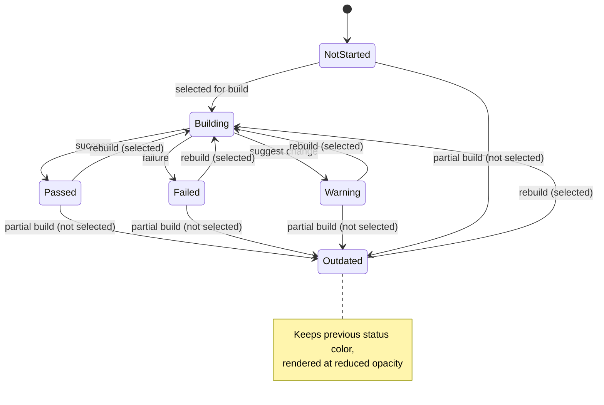
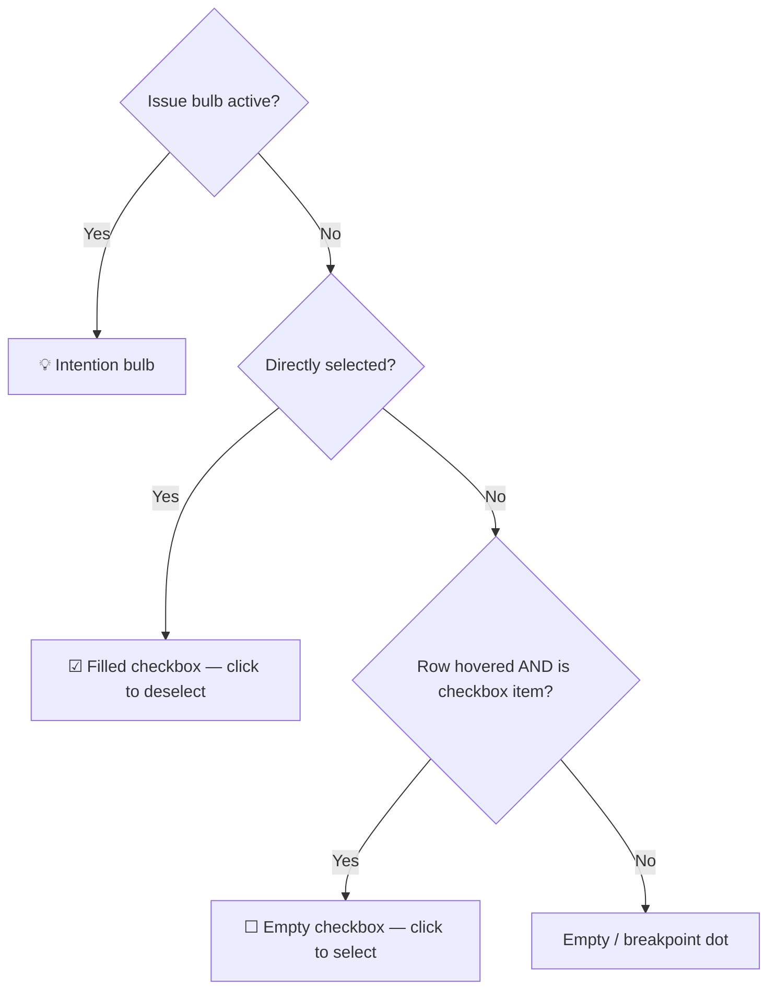

# Spec Execution Flow — формальная модель

---

## Инварианты

### I1. Checkbox item — единица исполнения
Движок не различает секции (Plan, AC, etc.). Любая строка с чекбоксом `- [ ]` — самостоятельный исполняемый пункт. Нет специальной логики привязанной к названию секции.

### I2. Один Build в один момент времени
В каждый момент может быть не более одного активного Build. Пока Build активен, новый запустить нельзя — кнопка Build заменяется на Stop.

### I3. Partial build: невыбранные → Outdated
При запуске подмножества пунктов все **невыбранные** пункты переходят в Outdated. Выбранные — в Building, затем получают свой результат. Outdated — не отдельный статус, а **модификатор отображения**: пункт сохраняет свой предыдущий статус (Passed/Failed/Warning/NotStarted), но отображается с пониженной opacity. Цвет не меняется на серый.

### I4. Full build: Outdated на время исполнения
При запуске без выделения (Build всей спеки) все пункты переходят в Outdated. По мере того как агент ставит результаты, пункты получают свежий статус (Passed/Failed/Warning) и Outdated снимается. Агент может менять спеку по ходу (добавлять/переформулировать пункты) согласно Spec Flow.

### I5. Статус пункта — от последнего Build, в котором он участвовал
Каждый пункт хранит результат от последнего Build, в котором он был выбран. Если пункт не участвовал в Build — его статус не меняется (кроме получения модификатора Outdated).

### I6. Selection: parent → children следуют, но чекбоксы у всех
Чекбокс выделения в гаттере показывается для **всех** checkbox-пунктов (и top-level, и nested). При выделении top-level пункта (parent) все его вложенные пункты (children) автоматически выделяются визуально. Фон подсветки покрывает parent + children без разрывов. Можно также выделить только child отдельно.

### I7. Gutter — выделение, не запуск
Hover на гаттере checkbox-пункта показывает чекбокс выделения (не Build-кнопку). Запуск — только через тулбар. Статичных Build-кнопок на заголовках секций нет.

### I8. Spec Flow определяет правила исполнения
Spec Flow — MD-файл, выбираемый в тулбаре (picker). Описывает формат спеки и как агент должен её исполнять. Есть набор дефолтных + пользовательские. Picker доступен и на пустой, и на готовой спеке.

### I9. Diff появляется только после Build
Changed files в inspection widget и Build navigator видны только после завершения хотя бы одного Build. До первого Build — скрыты.

### I10. Единый тул интеракции: «изменить состояние чекбокса»
Вся интеракция с пунктом реализуется через один абстрактный тул — **set_checkbox_state**. Тул принимает целевой пункт и payload с данными. Через него реализуются:
- **checks** — добавление пройденных/непройденных проверок (subchecks)
- **status** — выставление Passed / Failed / Warning
- **attach research** — прикрепление данных от агента (рассуждения, контекст, доп. материалы), которые показываются в отдельном research view

Это расширяемая точка: в будущем можно добавлять новые типы payload (attach diff, attach logs, etc.) без изменения модели.

```
set_checkbox_state(target, payload)

payload variants:
  { status: 'passed' | 'failed' | 'warning' }
  { checks: [{ status, text, chip? }] }
  { research: { summary, reasoning, artifacts[] } }
  // extensible — new payload types added without model changes
```

### I11. Extract to subtask
При выделении 2+ пунктов в тулбаре появляется кнопка **[↗ Extract]** (рядом с Build). Клик создаёт новую спеку-подзадачу:
- AI генерирует полноценную спеку (Goal, Plan, AC, etc.) на основе выбранных пунктов и контекста родительской спеки
- AI генерирует имя файла на основе контента
- Subtask появляется как дочерний файл в Agent Tasks tree (вложен под родительскую спеку)
- В frontmatter родительской спеки добавляется `subspec: ./subtask-name.md` (не рендерится)
- Контент родительской спеки **не изменяется**. На следующий Specify агент может сослаться на subtask линкой
- Subtask **полностью независим**: собственный Build, статусы, Spec Flow, diff
- Кнопка Extract скрыта при 0–1 выделенных пунктах

```
0-1 selected:
  ... | [▶ Build]          | [↻ Specify]

2+ selected:
  ... | [▶▶ Build 3] [↗ Extract] | [↻ Specify]
```

### I12. Два уровня diff
- **Inspection widget** (правый верхний угол): changed files последнего (или выбранного) Build. Клик по файлу → diff в отдельном табе.
- **Agent Tasks panel** (под спекой): аккумулятивный diff за все раны.
- Inline "Show diff" на пунктах — убран.

---

## Состояния пункта

```
NotStarted — пункт не исполнялся ни разу
Building    — пункт исполняется прямо сейчас
Passed     — пункт исполнен успешно
Failed     — пункт не исполнен
Warning    — агент предлагает изменить формулировку

Outdated(S) — модификатор поверх любого S ∈ {NotStarted, Passed, Failed, Warning}
              визуально: opacity ~0.4–0.5, цвет сохраняется
```



---

## Переходы

### T1. Full Build (ничего не выделено)

**Предусловие:** нет выделенных пунктов, Build не активен.

| Шаг | Что происходит |
|-----|---------------|
| 1 | Все checkbox items → Outdated (сохраняют предыдущий статус, но приглушены) |
| 2 | Build button → ■ Stop |
| 3 | Selection сбрасывается (noop — и так пуста) |
| 4 | Агент исполняет пункты по порядку документа |
| 5 | По мере получения результата каждый пункт: Outdated снимается → Passed / Failed / Warning |
| 6 | Агент МОЖЕТ менять спеку по ходу (I4) |
| 7 | Build завершается → Build button → ▶ Build |
| 8 | Changed files появляются в inspection widget (I9) |

**Postcondition:** все пункты имеют свежий статус ≠ NotStarted. Outdated нет ни у кого.

---

### T2. Partial Build (выделены N пунктов)

**Предусловие:** N > 0 пунктов выделено, Build не активен.

| Шаг | Что происходит |
|-----|---------------|
| 1 | Выделенные пункты → Building |
| 2 | **Все невыбранные** пункты → Outdated (I3) |
| 3 | Selection сбрасывается |
| 4 | Build button → ■ Stop |
| 5 | Агент исполняет только выбранные пункты |
| 6 | Агент НЕ МОЖЕТ менять спеку и добавлять пункты |
| 7 | Каждый выбранный пункт получает статус: Passed / Failed / Warning |
| 8 | Невыбранные пункты **остаются Outdated** с предыдущим статусом |
| 9 | Build завершается → Build button → ▶ Build |

**Postcondition:** выбранные пункты — свежий статус. Невыбранные — Outdated(previous status).

---

### T3. Stop (прерывание Build)

**Предусловие:** Build активен.

| Шаг | Что происходит |
|-----|---------------|
| 1 | Агент получает сигнал остановки |
| 2 | Пункты со статусом Building → последний полученный статус (или NotStarted если ничего не пришло) |
| 3 | Build button → ▶ Build |
| 4 | Changed files — частичные (что успело выполниться) |

---

### T4. Edit текста пункта

| Что | Результат |
|-----|-----------|
| Specify button | → Enabled (есть pending changes) |
| Статус отредактированного пункта | → Outdated (I5 — текст изменился, результат неактуален) |
| Статусы остальных пунктов | Не меняются |

---

### T5. Comment на пункте

| Что | Результат |
|-----|-----------|
| Specify button | → Enabled |
| Статусы пунктов | Не меняются |

---

### T6. Specify

| Что | Результат |
|-----|-----------|
| Все статусы пунктов | Сбрасываются (спека перегенерирована) |
| Changed files | Очищаются |
| Specify button | → Disabled (нет pending changes) |

---

### T7. Смена Spec Flow

| Что | Результат |
|-----|-----------|
| Статусы пунктов | Не меняются |
| Changed files | Не меняются |
| Следующий Build | Использует новый Spec Flow |

---

### T8. Extract to subtask

**Предусловие:** 2+ пунктов выделено, Build не активен.

| Шаг | Что происходит |
|-----|---------------|
| 1 | Selection сбрасывается |
| 2 | Имя файла генерируется из текста первого выбранного пункта (slug) |
| 3 | Выбранные пункты **копируются как есть** в новую спеку (Goal + Plan с копиями) |
| 4 | Subtask появляется в Agent Tasks tree как дочерний узел |
| 5 | Subtask открывается в новом табе (состояние `done`) |
| 6 | **Specify подсвечивается** на subtask — при нажатии агент проработает сырую копию в полноценную спеку по формату |
| 7 | **Specify подсвечивается** на родительской спеке — при нажатии агент заменит извлечённые пункты ссылками на subtask с кратким пояснением |
| 8 | Контент родительской спеки **не изменяется** до Specify |
| 9 | В `interactiveTaskState` родителя сохраняется `pendingExtractSpecify` с именем subtask и текстами |

**Postcondition:** 
- Subtask — сырая копия пунктов, Specify badge горит.
- Родительская спека — без визуальных изменений, Specify badge горит.
- При Specify subtask → агент генерирует полноценную спеку.
- При Specify родителя → агент подставляет ссылки на subtask вместо извлечённых пунктов.

**Agent Tasks tree:**
```
spring-petclinic/
  visit-booking.md              2m     [Specify ⚠]
    schema-changes.md                  [Specify ⚠] ← новый subtask
  vet-schedules.md              15m
```

---

## Selection

### Gutter states (приоритет сверху вниз)



### Selection → Toolbar actions

| Selection state | Build | Extract | Icon |
|----------------|-----|---------|------|
| 0 | ▶ Build | hidden | single triangle |
| 1 | ▶ Build | hidden | single triangle |
| 2+ | ▶▶ Build N | ↗ Extract | double triangle |

Selection сбрасывается при старте Build или Extract.

---

## Toolbar

```
0-1 selected:
┌─────────────────────────────────────────────────────────────────────┐
│ [icon] Title          [Spec Flow ▾]  [+]  │  [▶ Build]  │  [↻ Specify] │
└─────────────────────────────────────────────────────────────────────┘

2+ selected:
┌──────────────────────────────────────────────────────────────────────────────┐
│ [icon] Title    [Spec Flow ▾]  [+]  │  [▶▶ Build 3]  [↗ Extract]  │  [↻ Specify] │
└──────────────────────────────────────────────────────────────────────────────┘
```

- **Spec Flow ▾** — доступен всегда (и на пустой спеке). Dropdown с дефолтными и пользовательскими flow-файлами.
- **[+]** — добавить файлы-ссылки.
- **▶ Build / ▶▶ Build N / ■ Stop** — адаптируется по selection и состоянию.
- **↻ Specify** — disabled пока нет правок/комментариев.

---

## Inspection Widget

```
До Build:
  ⚠ 0  ❌ 0  💬 0  │ v1

После 1 Build:
  ⚠ 2  ❌ 1  💬 3  │ 📄 3  │ v1  │ Build #1

После N Build:
  ⚠ 2  ❌ 1  💬 3  │ 📄 3  │ v3  │ ◀ Build #3 ▶
```

- **📄 N** — кол-во файлов, изменённых в текущем Build. Клик → popup со списком файлов (+N −M). Клик по файлу → diff tab. Скрыто если Build не менял файлов.
- **◀ Build #N ▶** — навигация между Build. Стрелки только при > 1 Build.
- Переключение Build меняет popup файлов и подсветку пунктов.

---

## Transition Matrix

| Действие | Выбранные items | Невыбранные items | Changed files | Specify | Build button |
|----------|----------------|-------------------|---------------|---------|------------|
| **Full Build** | Все → Outdated → result по мере исполнения | — | Обновляются | Без изменений | → ■ Stop → ▶ Build |
| **Partial Build** | → Building → result | → Outdated(prev) | Обновляются | Без изменений | → ■ Stop → ▶ Build |
| **Stop** | Building → last received | Без изменений | Частичные | Без изменений | → ▶ Build |
| **Edit** | — | — | Без изменений | → ✓ Enabled | Без изменений |
| **Comment** | — | — | Без изменений | → ✓ Enabled | Без изменений |
| **Specify** | Все → reset | Все → reset | Очищаются | → 🔒 Disabled | Без изменений |
| **Смена Spec Flow** | Без изменений | Без изменений | Без изменений | Без изменений | Без изменений |
| **Extract to subtask** | Без изменений | Без изменений | Без изменений | Без изменений | Selection cleared, Extract hidden |
