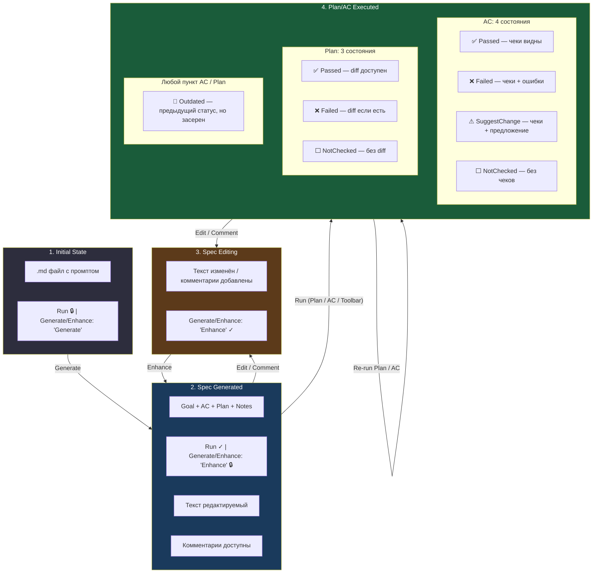
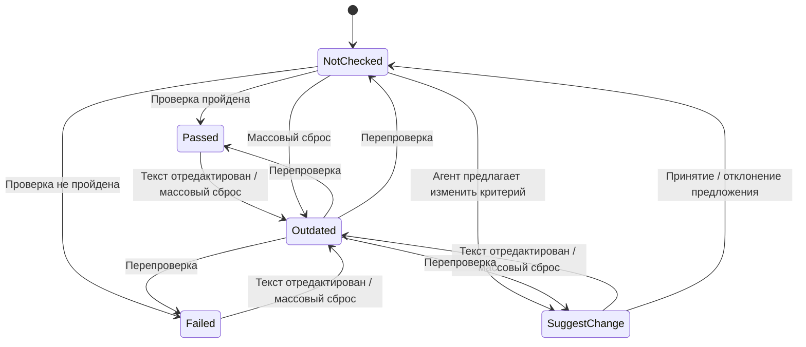
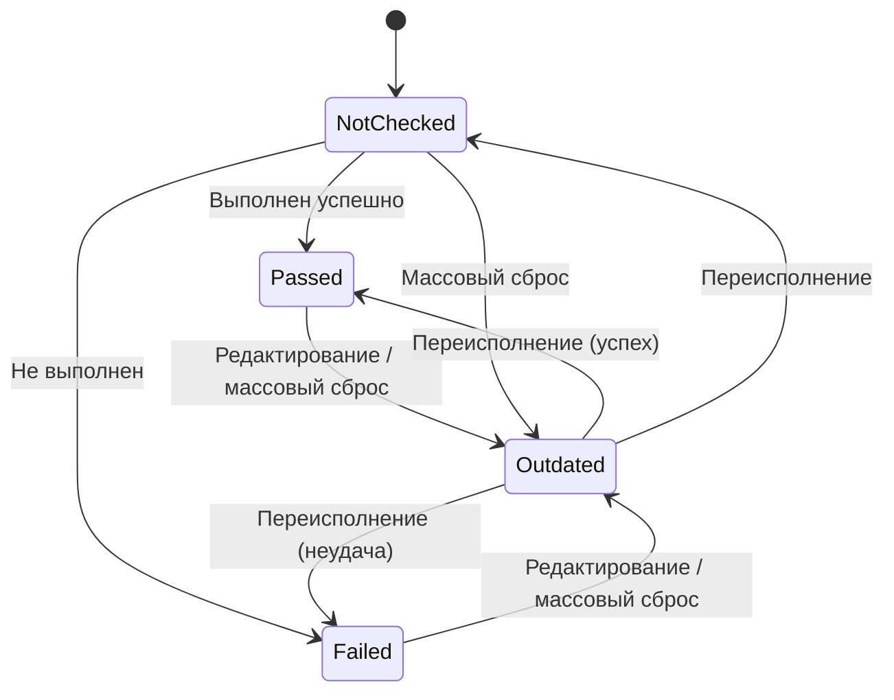
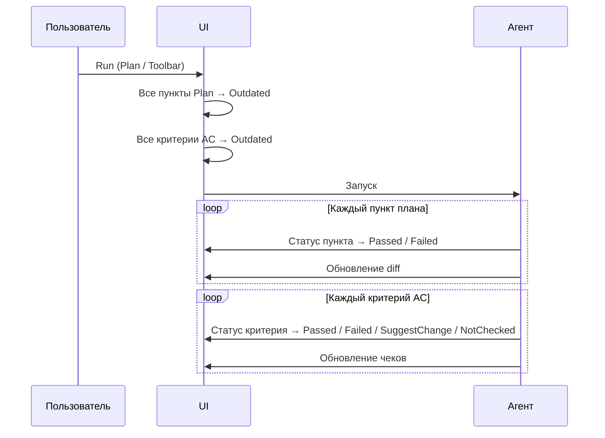
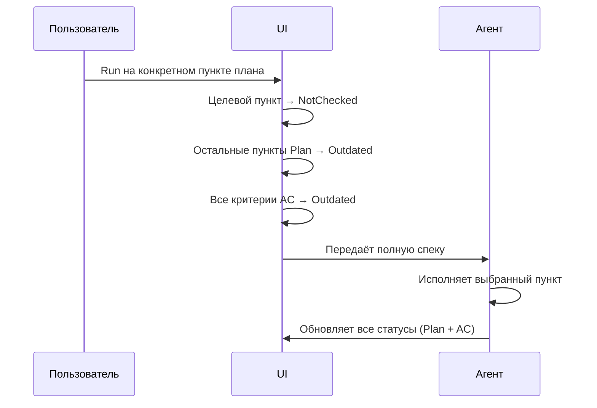
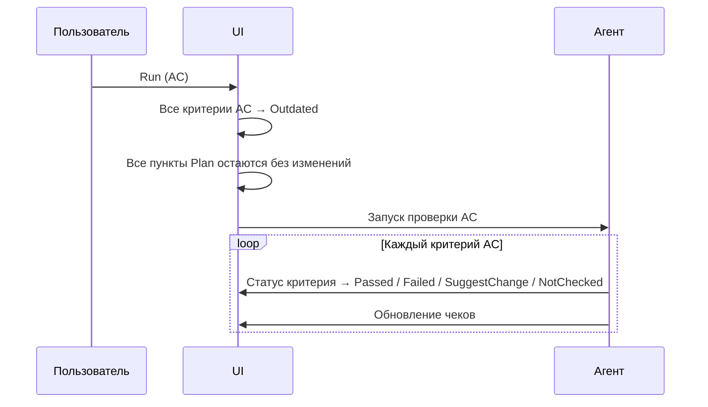

# Spec Flow: Agent Task Specification Lifecycle

Документ описывает полный жизненный цикл спецификации агентной задачи: от промпта в файле до исполнения плана и проверки Acceptance Criteria.

---

## Полная карта состояний

---

## Статус Outdated

Общий статус для пунктов AC и Plan. Не является отдельным состоянием — это **модификатор отображения**: пункт сохраняет свой предыдущий статус (Passed, Failed, SuggestChange, NotChecked), но отрисовывается **приглушённым засеренным цветом**.

Пункт становится Outdated когда:
- **AC**: текст критерия отредактирован после проверки
- **Plan**: текст пункта отредактирован после исполнения
- **Любой**: запущено переисполнение другого пункта или всего плана (массовый сброс)

Пункт перестаёт быть Outdated когда:
- Проведена перепроверка / переисполнение этого пункта — статус обновляется на актуальный

---

## 1. Initial State

### Контент

- Открыт `.md` файл с текстовым промптом (описание задачи)
- Файл содержит только промпт, спецификация ещё не сгенерирована

### Состояние кнопок

| Кнопка | Состояние | Условие |
|--------|-----------|---------|
| **Run** | 🔒 Disabled | Спецификации нет, или она не соответствует формату (эвристика) |
| **Generate/Enhance** | ✓ Enabled, текст: **"Generate"** | Спецификации нет — предлагается сгенерировать |

### Переходы

| Переход | Действие | Что происходит |
|---------|----------|----------------|
| **→ 2. Spec Generated** | Нажата кнопка **Generate** | Агент генерирует спецификацию из промпта. Появляются секции: Goal, Acceptance Criteria, Plan, Notes. |

---

## 2. Spec Generated

### Контент

Спецификация отображена в структурированном виде:

| Секция | Описание |
|--------|----------|
| **Goal** | Краткое описание цели задачи |
| **Acceptance Criteria** | Список критериев приёмки (чекбоксы) |
| **Plan** | Список шагов реализации |
| **Notes** | Дополнительные заметки |

- В верхнем тулбаре отображается **саммари** спецификации
- Текст во всех секциях **редактируемый**
- Во всех секциях можно **оставлять комментарии**

> **TODO (Notes)**: в текущем прототипе вместо единой секции **Notes** используются три: **Implementation Notes**, **Tradeoffs**, **Other**. Нужно решить, сводить ли их в одну `Notes` или оставить разбивку (см. «Открытые вопросы»).

### Состояние кнопок

| Кнопка | Состояние | Условие |
|--------|-----------|---------|
| **Run** (toolbar) | ✓ Enabled | Спецификация корректна |
| **Run** (AC) — иконка в гуттере у заголовка `## Acceptance Criteria` | ✓ Enabled | Проверяет только AC |
| **Run** (Plan) — иконка в гуттере у заголовка `## Plan` | ✓ Enabled | Исполняет план, затем проверяет AC |
| **Generate/Enhance** | 🔒 Disabled, текст: **"Enhance"** | Нет правок и комментариев |

> В текущем прототипе «Run (AC)» и «Run (Plan)» — это **иконки запуска в гуттере** рядом с заголовками секций `## Acceptance Criteria` и `## Plan`, а не отдельные кнопки в тулбаре. В тулбаре есть только общая кнопка **Run** (Toolbar).

### Переходы

| Переход | Действие | Что происходит |
|---------|----------|----------------|
| **→ 3. Spec Editing** | Пользователь **редактирует текст** или **оставляет комментарий** | Кнопка Enhance разблокируется. Контент изменён, но спека ещё не перегенерирована. |
| **→ 4. Executed** | Нажата кнопка **Run** (Toolbar или Plan) | Все пункты плана исполняются последовательно, затем проверяются все AC. У каждого пункта появляется статус. |
| **→ 4. Executed** | Нажата кнопка **Run** (AC) | Проверяются только Acceptance Criteria без исполнения плана. У каждого критерия появляется статус. |

---

## 3. Spec Editing

### Контент

Контент идентичен **2. Spec Generated**, но с пользовательскими изменениями:
- Текст в одной или нескольких секциях отредактирован
- И/или добавлены комментарии к пунктам

### Состояние кнопок

| Кнопка | Состояние | Условие |
|--------|-----------|---------|
| **Run** (toolbar) | ✓ Enabled | Спецификация корректна |
| **Generate/Enhance** | ✓ Enabled, текст: **"Enhance"** | Есть правки или комментарии |

### Переходы

| Переход | Действие | Что происходит |
|---------|----------|----------------|
| **→ 2. Spec Generated** | Нажата кнопка **Enhance** | Агент перегенерирует спеку с учётом правок и комментариев. Enhance снова блокируется. |

---

## 4. Plan/AC Executed

### Контент — Acceptance Criteria

Каждый критерий AC имеет одно из 4 состояний (+ Outdated-модификатор):

| Состояние | Иконка | Чеки | Описание |
|-----------|--------|------|----------|
| **Passed** | ✅ | Отображены (зелёные) | Критерий пройден |
| **Failed** | ❌ | Отображены, непройденные выделены | Критерий не пройден |
| **SuggestChange** | ⚠ | Отображены + предложение изменить критерий | Агент считает, что критерий нужно скорректировать |
| **NotChecked** | ⬜ | Нет | Критерий не проверялся, галка unchecked |
| **Outdated** | 🔘 | Засерены (grayed out) | Предыдущий статус сохранён, но отображается приглушённо |

### Контент — Plan

Каждый пункт плана имеет одно из 3 состояний (+ Outdated-модификатор):

| Состояние | Иконка | Diff | Описание |
|-----------|--------|------|----------|
| **Passed** | ✅ | Доступен (Show diff) | Пункт выполнен успешно |
| **Failed** | ❌ | Доступен, если есть изменения | Пункт не выполнен |
| **NotChecked** | ⬜ | Нет | Пункт не проверялся |
| **Outdated** | 🔘 | — | Предыдущий статус сохранён, но отображается приглушённо |

### Состояние кнопок

| Кнопка | Состояние | Условие |
|--------|-----------|---------|
| **Run** (toolbar) | ✓ Enabled | Переисполняет весь план + AC |
| **Run** (AC) — иконка в гуттере у `## Acceptance Criteria` | ✓ Enabled | Перепроверяет все AC |
| **Run** (Plan) — иконка в гуттере у `## Plan` | ✓ Enabled | Переисполняет весь план + AC |
| **Generate/Enhance** | 🔒 Disabled, текст: **"Enhance"** | Нет правок (Enabled если есть правки/комментарии) |
| **Run** (per AC/Plan item) — иконка в гуттере конкретной строки | ✓ Enabled | Перепроверяет конкретный пункт |

> **Per-item Run**: Run-иконка на конкретном пункте AC/Plan отображается в гуттере **только при hover** соответствующей строки.

### Переходы

#### Переисполнение плана целиком

| Переход | Действие | Что происходит |
|---------|----------|----------------|
| **→ 4. Executed** (self) | Нажата кнопка **Run** (Toolbar / Plan) | 1. Все пункты Plan → Outdated. 2. Все критерии AC → Outdated. 3. Агент последовательно исполняет каждый пункт плана, обновляя статусы и diffs. 4. Агент проверяет каждый критерий AC, обновляя статусы и чеки. |

#### Переисполнение одного пункта плана

| Переход | Действие | Что происходит |
|---------|----------|----------------|
| **→ 4. Executed** (self) | Нажата кнопка **Run** на конкретном пункте | 1. Целевой пункт → NotChecked. 2. Остальные пункты Plan → Outdated. 3. Все критерии AC → Outdated. 4. Агент получает полную спеку, исполняет пункт и заново обновляет все стейты (Plan + AC). |

#### Перепроверка всех AC

| Переход | Действие | Что происходит |
|---------|----------|----------------|
| **→ 4. Executed** (self) | Нажата кнопка **Run** (AC) | 1. Все критерии AC → Outdated. 2. Пункты Plan не затрагиваются. 3. Агент проверяет каждый критерий, обновляя статусы и чеки. |

#### Перепроверка одного критерия AC

| Переход | Действие | Что происходит |
|---------|----------|----------------|
| **→ 4. Executed** (self) | Нажата кнопка **Run** на конкретном критерии | 1. Целевой критерий → Outdated. 2. Остальные критерии AC и пункты Plan не затрагиваются. 3. Агент проверяет критерий, обновляя его статус и чеки. |

#### Редактирование

| Переход | Действие | Что происходит |
|---------|----------|----------------|
| **→ 3. Spec Editing** | Пользователь **редактирует текст** AC | Изменённый критерий → Outdated. Остальные не затрагиваются. Enhance разблокируется. |
| **→ 3. Spec Editing** | Пользователь **редактирует текст** Plan | Изменённый пункт → Outdated. Остальные не затрагиваются. Enhance разблокируется. |
| **→ 3. Spec Editing** | Пользователь **оставляет комментарий** | Enhance разблокируется. Статусы не меняются. |

---

## Матрица переходов: действие → что меняется

| Аспект | Run (Toolbar) | Enhance | AC Run | AC Item Run | Plan Item Run | Edit AC | Edit Plan | Comment |
|--------|---------------|---------|--------|-------------|---------------|---------|-----------|---------|
| **Plan статусы** | All → Outdated → Re-exec | — | Не меняются | Не меняются | Target → NotChecked, rest → Outdated → Re-exec | Не меняются | Item → Outdated | Не меняются |
| **AC статусы** | All → Outdated → Re-check | — | All → Outdated → Re-check | Target → Outdated → Re-check, rest не меняются | All → Outdated → Re-check | Item → Outdated | Не меняются | Не меняются |
| **Diffs** | Обновляются | — | Не меняются | Не меняются | Обновляются | Не меняются | Не меняются | Не меняются |
| **Enhance** | Не меняется | 🔒 после использования | Не меняется | Не меняется | Не меняется | ✓ Enabled | ✓ Enabled | ✓ Enabled |

---

## Открытые вопросы

- [ ] **Как обновляются дифы?** При переисполнении пункта плана — diff пересчитывается относительно чего? Относительно состояния до первого исполнения? Относительно предыдущего исполнения? Накапливаются ли дифы между запусками?
- [ ] **Секции Notes — единая или разбитая?** В прототипе используется разбивка на `Implementation Notes` / `Tradeoffs` / `Other`. Сводить ли их в одну секцию `Notes`, как в спеке?
