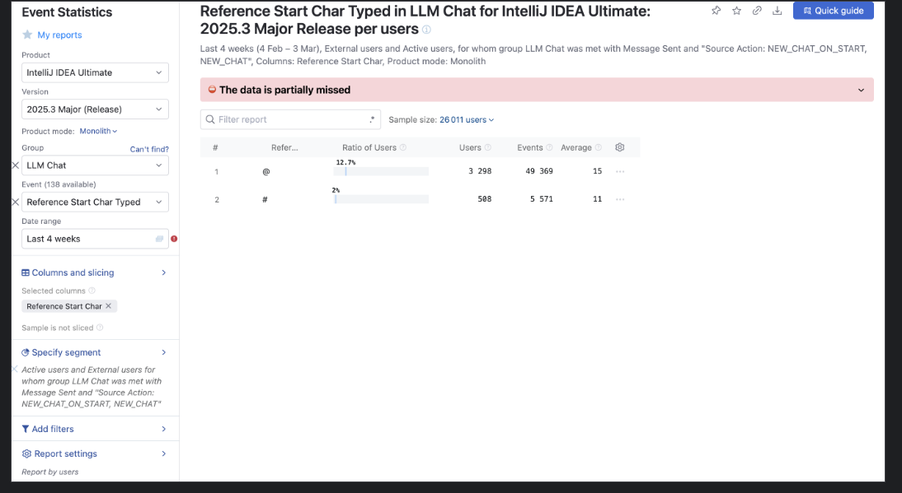
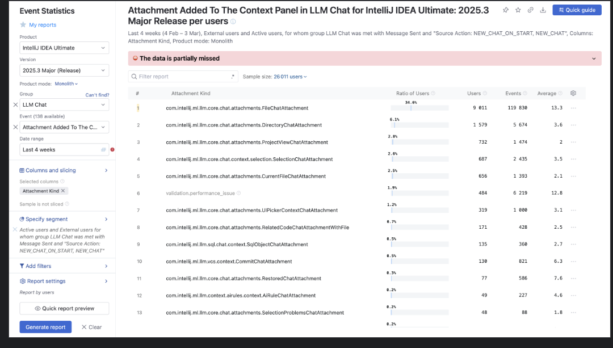
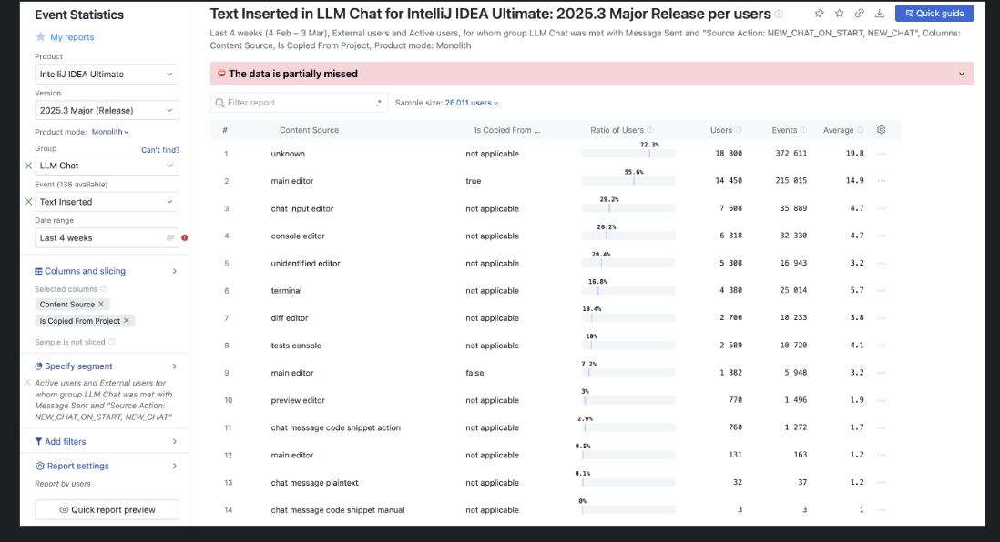
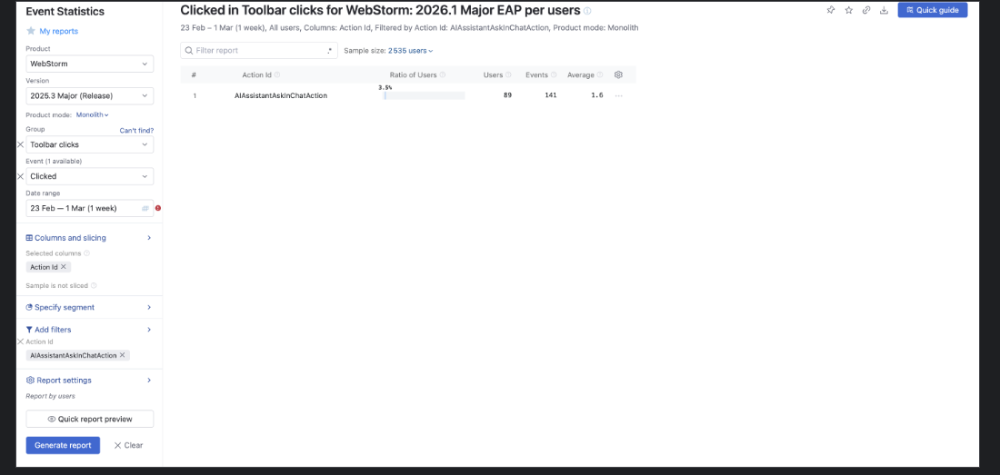

# PRD: Code Notes — Comments as AI Chat Context

## Problem & Objective

### Context

Developers working with an AI agent run the same loop many times a day: assign a task → review the resulting diff. At both ends of this loop they constantly need to point the agent at specific places in the code:

- when assigning a task — which chunk to work on (“rewrite this function”, “fix this loop”);
- when reviewing — what exactly in the diff needs to be changed.

Today this turns into a grab-bag of workarounds: copy file paths and line numbers, attach files, paste snippets, use `@`-mentions in the input, or even leave comments directly in the code and reference them from the prompt. We believe these workarounds create meaningful friction at both ends of the loop and slow developers down.

### Problem

Before we commit to a design, we need to understand where the friction actually lives — at each of the two ends of the loop:

- How do developers reference specific code when writing tasks for an agent today, and what’s painful about it?
- How do developers write code-review comments for an agent today, and what’s painful about it?

### Objective

Make it meaningfully easier for developers to point an agent at specific code on both ends of the loop — both when assigning work and when reviewing its output — so the back-and-forth feels as fast and precise as pointing at code in a conversation with a teammate. The discovery described in this PRD is the first step toward that outcome.

---

## Code Notes

Code Notes is a proposed feature that builds on a pattern that has emerged across review-oriented agent tools over the past year (CodeRabbit, Greptile, Cursor Bugbot, Claude Code Review mode, and others): let developers attach lightweight annotations directly to code locations, and let the agent consume them as structured context — both when receiving a new task and when acting on review feedback.

---

## Reasoning

Existing task-assignment mechanics are already relatively mature across the industry (selection-to-chat, inline edit, `@`-mentions, context actions) and are actively used by users today. Current research and metrics do not yet show a strong signal that an entirely new interaction model is needed on the task-assignment side.

Review workflows for agent-generated changes, on the other hand, remain fragmented and underdeveloped. Users still struggle to precisely communicate requested fixes inside diffs, while feedback is often split between chat, VCS, and code. Most modern AI-review tools are already moving toward iterative review workflows, creating a strong market expectation in this area.

Additionally, review comments for agent-generated diffs are easier to scope, prototype, validate, and measure. The mechanics introduced in this flow can later become reusable primitives for broader Code Notes workflows, including task assignment and SDD flows.

---

## Target Users

Engineers for whom working with an AI agent is not a one-off prompt but a recurring loop of “assign a task → review the result” on an existing codebase. At both ends of this loop they need to point the agent at specific places in the code many times a day — at task assignment, which chunk to work on; at review, what in the diff needs fixing.

This is **not** the greenfield / “prompt-to-app” user who sends the agent one instruction and accepts the output as-is.

---

## Validation

### 1. Metrics that should be validated to confirm referencing specific code at task-assignment time is inconvenient

- How often people use special characters in the chat input when composing a prompt (already an industry de-facto).

  

- How often people attach files when writing a prompt or add file/code context.

  

- How often people copy content from the editor into the input while composing a prompt.

  

- Whether people use additional solutions to add IDE context into the input.

  

- Behavioral patterns also suggest that users may leave comments directly in the code and then reference them in the input when writing a prompt.

### 2. Competitor review: selection / context-to-chat in adjacent IDEs

A scan of the eight closest comparators in the AI-IDE space shows which mechanics for “get code from the editor into the agent prompt” have already become standard.

| Product | Selection / context to chat |
|---|---|
| Cursor | `⌘K` — inline edit; `⌘⇧L` — send selection to chat; `⌘I` — Composer/Agent |
| Windsurf | `⌘I` / `Ctrl+I` — Command mode (inline); `⌘/Ctrl+⇧+.` — Explain & Fix from an error |
| Copilot | `⌘I` / `Ctrl+I` — Inline Chat (editor and terminal); `⌘N` — new chat inside the panel |
| Zed | `⌘↵` / `Ctrl+Enter` — Inline Assistant (editor and terminal) |
| JetBrains AI Assistant / Junie | Via the AI Actions context menu; hotkeys assigned manually in Keymap → Plugins → JetBrains AI Assistant |
| Codex | `chatgpt.addToThread` — selection to thread (no default hotkey); `chatgpt.implementTodo` — implement a TODO from a comment |
| Antigravity | Selection in editor/terminal + `⌘L` — send to agent; `@` in composer — files, directories, MCP servers |
| Kiro | Selection + `⌘L` sends lines to chat; `@` in chat for files, URLs, Docs |

Takeaways:

- **Selection-to-chat** has become a universal primitive — every product in the set binds a single hotkey to “push the selected code into the agent prompt.” Users arrive expecting it.
- **Inline edit** is a parallel track — Cursor’s `⌘K`, Windsurf’s `⌘I`, Copilot’s `⌘I`, and Zed’s `⌘↵` all offer a way to skip chat entirely for small in-place edits.
- **`@`-mentions** cover “context that isn’t currently selected” — files, folders, docs, MCP servers (Antigravity, Kiro). The de-facto pattern when the relevant code isn’t under the cursor.
- **Code-comments-as-context** is mostly unexplored — only Codex’s `implementTodo` treats an in-code comment as a first-class agent trigger. This is the territory Code Notes would extend into, and where the market is not currently crowded.

The metrics above and this scan together support the scope call below: existing mechanics on the task-assignment side are well-developed and widely adopted.

### 3. Research needed to validate the hypothesis “writing code-review comments for an agent today is inconvenient”

- Run a problem-focused study with the research team to identify pain points in the user flow when reviewing agent-made changes in a diff, both within our IDEs and when working with third-party tools.
- Analyze competitors providing similar features in third-party tools: CodeRabbit, Greptile, Qodo, Claude Code Review mode, Cursor Bugbot, Sweep AI, Bito AI Code Review, CodiumAI / PR-Agent, Graphite.

---

## Success Criteria

### 1. Referencing Code in Agent Tasks

- **Friction reduction**: ≥ 20% reduction in time from code selection to task submission.

### 2. Attach Code Review Comment for Agent

- **Discoverability and active use**: percentage of users who create at least one inline comment after opening an agent-generated diff.
  - Baseline: 0% (feature does not exist today).
  - Initial target: 25%+.
- **Conversion to send**: percentage of created comments that are submitted to the agent.
  - Baseline: no structured review-comment workflow exists today.
- **Retention W7 / W14** of users who created at least one inline comment.
  - Cohort entry: user creates at least one inline comment during an agent review session.
  - Reference benchmark: Generate Commit Message — ≈40% W7.
  - Initial target: 25–30% W7.

---

## Scope Decision

### 1. Referencing Code in Agent Tasks

Based on the metrics we see in the reports, users are actively using the existing solutions and the usage rate is fairly high. At the moment, there is no clear signal that an additional new solution is needed.

### 2. Attach Code Review Comment for Agent

There is a clear signal to implement this functionality; it is becoming a kind of industry standard that we need to move toward. Similar functionality exists in almost all of the tools mentioned above. Additionally, the patterns and mechanics implemented in this part can be reused for task assignment. It is also a good opportunity to reuse them for SDD, where similar mechanics are actively used (Conductor, Antigravity, and others).

Most of the implementation details will be obtained after the planned research. The rest of this document captures the behavior already implemented in the prototype.

---

## User Flow — Agent Change Review (Commenting Flow)

### Entry Point

The user is working inside an already active agent session. The session can be started from:

- Chat;
- VCS;
- SDD flow;
- Terminal flow.

Within this active session, the user can leave comments for the agent directly inside the agent-generated diff.

The diff can open from any review entry point, not only from the AI chat. Examples:

- the Commit tool window;
- the editor tab strip or an already-open diff tab;
- the agent message card in the AI chat that describes the change;
- an attachment chip in message history that leads back to the comment;
- a plan, SDD, problem, or other navigation item that points to a diff.

The comment behavior is the same regardless of where the diff was opened from. Historical/read-only diffs are the exception: they can display existing comments, but users cannot add new comments there.

Entry points into commenting itself:

- gutter icon next to a line in an open diff;
- gutter icon next to a line in a regular file (once the feature is enabled);
- shortcut `⌥⇧K` — works both on a single line (caret position) and on a selected line range;
- the `+` menu next to the AI chat input (toggles surfaces on/off);
- settings: `Tools > AI Assistant > Comments`;
- the gutter context menu (`Enable/Disable Diff Comments` / `Enable/Disable File Comments`).

### Surfaces and Default Values

- **Diff** — comments are enabled by default.
- **Regular editor file** — comments are disabled by default and are enabled by the user.
- **AI chat** — comments appear as an attachment next to the input and in message history.

### Discoverability and Onboarding

#### In-chat promo banner

When the user has already sent at least one message in the chat **and** in that same chat adds a new comment in a diff (not editing an existing one), the AI chat shows a banner:

> You can now leave comments directly on editor files.
>
> [Enable File Comments]

Display conditions:

- file comments are currently disabled;
- the current surface is a diff (not a regular file);
- it is a new comment, not an edit;
- the target chat already has user messages sent;
- after the operation, there is at least one comment in the chat in total.

After the action is clicked, the banner disappears and gutter controls turn on in regular files. The banner can also be dismissed without taking the action — in that case it does not come back in the current chat session.

#### Settings `Tools > AI Assistant > Comments`

In IDE Settings, under `Tools > AI Assistant > Comments`, the user controls the feature globally. The section contains two independent toggles:

- `Enable Comments in Files` — toggles gutter controls in regular files.
- `Enable Comments in Diffs` — toggles gutter controls in agent diffs.

Settings behavior:

- The toggles are independent: you can enable in diffs only, in files only, in both, or in neither.
- Setting values are synchronized with the states available via the gutter menu and the chat `+` menu — a change in any of those places is reflected in settings.
- Defaults follow the overall rule: `Enable Comments in Diffs` is on, `Enable Comments in Files` is off.
- Disabling a surface hides its gutter controls and compose flow, but already-created comments are not removed and become visible again when the surface is re-enabled.
- Changing the setting while a composer is open closes the composer without saving, if its surface gets disabled.

#### Enabling / disabling via the gutter menu

The gutter context menu contains the corresponding item:

- in a diff: `Enable Diff Comments` / `Disable Diff Comments`;
- in a regular file: `Enable File Comments` / `Disable File Comments`.

Disabling a surface hides its gutter controls; already-created comments remain accessible.

#### Behavior when a surface is disabled with comments already in place

If the user disables the feature (via Settings, the gutter menu, or the `+` menu) **after comments have already been left**, those comments are not deleted and still participate in being sent to the agent:

- the comments stay in the system and are not lost;
- their gutter badges are hidden together with the rest of the feature’s gutter controls;
- attachment chips at the chat input **remain visible** and continue to show the counter/preview of these comments;
- Send in the chat remains available as usual — the user can submit the message, and **the agent receives the comments as context just as if the surface were enabled**;
- after the surface is re-enabled, gutter badges and popups return to their lines in their original form.

Disabling the feature is about the **visual UI on the surface**, not about data. The context already accumulated for the agent remains in effect.

#### The `+` menu next to the chat input

The `+` button next to the AI chat input opens an add-context menu. It includes the items:

- `Enable Diff Comments`
- `Enable File Comments`

Each item toggles the corresponding surface on/off — an alternative path to the same action available from the gutter menu and from Settings.

Naming is intentionally surface-specific:

- Settings use `Enable Comments in Files` and `Enable Comments in Diffs`.
- The `+` menu and gutter menu use `Enable File Comments` and `Enable Diff Comments`.

Discoverability:

- The `+` button shows a **blue dot** while there is unseen comment-context functionality.
- The blue dot disappears after either:
  - the add-context menu has been opened 6 times;
  - every menu item with a `New` label has been clicked once.
- Each menu item shows a `New` label. The label on a specific item disappears after the user clicks it; labels on the other items remain.

#### Shortcut tooltip

After the user has created their **first** comment, the IDE shows a one-time tooltip with the shortcut:

> A comment can be added from the keyboard: `⌥⇧K`

The tooltip is shown once and does not return.

The shortcut itself works in two modes:

- with no selection in the editor/diff and the caret on a line — opens the composer with the caption `Comment on line N`;
- with a selected line range — opens the composer with the caption `Comments on lines A to B`, and the native text selection stays visible while focus remains in the composer.

In both modes the behavior matches clicking the gutter icon — these are equivalent entry points.

### Gutter Icon

Icon behavior next to a line depends on whether the line has comments.

**On an empty line:**

- In the idle state the icon is not visible.
- On row hover, a balloon-style icon appears in muted gray.
- Clicking the icon opens the composer for a new comment.

**On a line with comments:**

- The icon is always visible and shows a badge: balloon + the count of comments on this line.
- On row hover, the badge visually transforms into a `+` (plus) icon: the count and the balloon are hidden and a plus is shown instead.
- Clicking the plus is the short path to add another comment to the same line/range without closing the existing popups.
- The active icon (composer open on this line) is highlighted with a pressed style. Opening the composer must not replace a native text selection with a synthetic full-row highlight.

**When the surface is disabled:** the gutter icon is hidden in all states.

### Composer: General Behavior

- Opens inline directly under the target line/range and shifts the code below it down. The comment UI participates in editor layout; it must not float over code text.
- Composition:
  - context header — chat icon and name; for the Active session a textual `Active Chat` badge; for Inactive — no badge, only a muted header tone;
  - text field with the placeholder `Write a comment`;
  - `Cancel` button;
  - primary submit with a label that matches the selected target;
  - range caption below the field (`Comment on line N` / `Comments on lines A to B`).
- The input is single-line by default. As text is typed or a multiline value is pasted, the field **grows in height** up to a fixed limit; beyond that, internal scrolling appears inside the field and the composer stays compact.
- When the composer opens, focus automatically goes into the text field.
- `Cancel` or a click outside the composer closes it without saving.
- Esc closes the composer; Enter with a modifier submits.
- While focus stays inside the composer, the line selection in the editor is not reset — the range that the future comment will attach to remains visible.
- If the user clicks back into the editor, the native selection may reset as normal editor behavior. The comment keeps its stored line/range target even after the visual selection disappears.
- When the text is empty, the primary submit button is disabled; empty comments are not submitted.

### Creating a Comment

**On a single line:**

1. The user hovers over a line → a balloon icon appears in the gutter.
2. Clicking the icon or pressing `⌥⇧K` from the line opens the composer.
3. The composer caption is `Comment on line N`.
4. After `Add a Comment`, the comment is anchored to the line: the gutter icon turns from a balloon into a badge with the count `1`, and an attachment chip appears at the chat input.

**On a line range:**

1. The user selects several lines (with the mouse or with Shift).
2. Invokes the gutter control on one of the selected lines or presses `⌥⇧K` — the composer opens with the caption `Comments on lines A to B`.
3. The editor selection is preserved while the user is in the composer — even when focus is in the text field, the selected text remains highlighted.
4. If the user clicks in the editor, the visual selection resets; the composer still targets the originally captured line range.
5. After saving, the comment is anchored to the whole range: one gutter badge appears next to the last line of the range, but logically it is one comment attached to the whole range.

**Target (chat-picker):**

In the composer the user chooses which chat the comment is attached to. By default it’s the currently open chat; the primary submit label in this state is `Add a Comment`.

The target can be changed right while writing the comment. Next to the primary submit there is a target picker. Clicking it opens a popup with:

- a list of recent chats (up to 5 most recent);
- a footer action `Create New Chat` that creates a new chat and switches the comment’s target to it;
- the currently open chat is marked active; the currently selected target is marked selected.

Only one new chat can be created from one open composer. After the user clicks `Create New Chat`, the same picker removes that footer action; the newly created chat remains selectable as the current target.

`Create New Chat` is also hidden when the selected target is already a newly created draft chat. In that state the user can still choose existing chats, but cannot create a second new chat from the same composer.

Selecting any item while creating a new comment:

- updates the comment’s target to the selected chat;
- updates the icon/name in the composer’s context header to match the selected chat;
- closes the picker popup.

After saving, the comment is considered owned by the selected chat — even if a different session is currently open in the right panel. In that case the comment immediately appears as **Inactive**.

In edit mode the primary submit is always labeled `Save Comment`; the target picker is not shown. Editing updates the text of the comment in the session that already owns it.

Edit mode remains active until the user explicitly clicks `Save Comment` or cancels the composer. It must not exit edit mode just because the text changed, the textarea lost focus, or the comment belongs to an Inactive session.

### Displaying Comments

**One comment on a line.** In the gutter — a badge with the icon and count `1`. Under the line a popup opens with the context header, the comment text, the line caption, and a `...` menu.

**One comment on a range.** A badge with count `1` is shown next to the last line of the range. The caption inside the comment is `Comments on lines A to B`. There is one popup for the whole range.

Range comments must never render one gutter icon per line. The only visible gutter affordance for the range is the single icon/badge at the bottom of the range.

**Multiple comments on the same line or range:**

- The gutter badge shows the total count.
- Each comment is rendered as a **separate popup** in a stack under the line, in creation order.
- Each popup has its own context header (own chat, own Active/Inactive state) and its own `...` menu.
- Comments that belong to the same chat session are still shown as separate popups — they do not merge into one list.

**Multiple comments from different chats.** A line can carry comments from different chat sessions. They are rendered as separate popups with different icons and context headers; each is marked with its corresponding Active/Inactive state.

Diff comments and regular-file comments are separate surfaces. A comment created in a diff does not appear in the regular file editor for the same file, and a comment created in a regular file does not appear in a diff for that file. Attachments and chips also keep the source surface identity separate.

### Session-Aware Comments

Comments are scoped to a specific chat session / execution context.

Every comment belongs to a specific chat session and at any moment is in one of two states:

**Active.** The comment’s chat session is the one currently open in the right-side AI chat panel. The header:

- shows an `Active Chat` badge in the active (blue) tone;
- the chat icon matches the current chat;
- the `...` menu is fully available: `Edit`, `Delete`.

**Inactive.** The comment’s chat session is different from the current one. The header:

- has no explicit textual badge — the Inactive state is recognizable only by the muted header tone (in contrast to the active `Active Chat` badge on Active comments);
- the name and icon of the chat the comment is attached to are still shown;
- clicking the header switches the right-side AI chat panel to that session — the comment immediately becomes Active and the popup re-renders with the active tone and the `Active Chat` text badge;
- the `...` menu is available: `Edit` and `Delete` operate on the chat session that owns this Inactive comment, not on the currently active session.

As a result:

- when switching between sessions the user only sees the comments of the selected session as Active; comments from other sessions on the same lines are marked Inactive;
- comments remain visible in the diff until the next agent run;
- if the user does not send a message to the agent, the comments remain in the diff as drafts.

### Multiple Comments: Grouping Rules

- An arbitrary number of comments can exist on a single line/range.
- Each comment is an independent popup with its own context header and menu.
- Display order is by creation time (oldest first).
- Deleting one comment does not affect the others.
- If all comments on a line are deleted, the gutter badge disappears and the control returns to its initial state.

### Editing

- Editing is available for Active and Inactive comments.
- The user can enter edit mode by clicking the comment text directly or via `...` → `Edit`.
- The same composer opens as on creation; the text and line/range caption are restored.
- A multiline comment preserves its original line range — it does not collapse to a single line, even if the user is currently standing on one of the lines of the range.
- On save, the gutter count and the attachment do not change — only the comment text does.
- If an Inactive comment is edited, the update is written to the original owning chat session.
- The target picker is not shown in edit mode; editing does not move a comment between chat sessions.
- The user remains in edit mode until `Save Comment` or an explicit cancel. Opening menus, typing, or focus changes do not implicitly leave edit mode.
- Canceling the edit does not change the comment.

### Deleting Comments

Comments can be deleted in two ways — both behave identically and lead to the same result:

**1. One by one, via the `...` menu of the comment:**

- `...` → `Delete` is available for Active and Inactive comments.
- Exactly one selected comment is removed.
- If the selected comment is Inactive, deletion is applied to its owning chat session.
- The gutter count is recomputed; if it was the last one — the badge disappears.
- The attachment chip count at the input is recomputed; if it was the last one — the chip disappears.

**2. In bulk, via the `×` button on the attachment chip at the input:**

- The `×` button on a draft chip at the input performs a **batch-delete of all comments included in that chip** — this is by design, not “only remove from the input.”
- As a result:
  - the chip disappears from the input;
  - all popups under the source lines disappear;
  - gutter badges are recomputed (lines that no longer have comments return to the “no comments” state).
- This is a convenient shortcut when the user decided to cancel the entire batch of comments before sending — no need to walk through each one via `Delete`.

In both cases deleted comments **cannot be restored** — they must be re-created. There is no `×` button on sent attachments in message history; they cannot be deleted this way.

### Switching Between Sessions

- The currently active chat session is the one selected in the right-side AI chat panel.
- The primary chat switcher is in the AI chat header: clicking the chat title in the header opens the chat list and lets the user switch sessions.
- On session switch:
  - comments of the new session become Active on their lines;
  - comments of the previous session become Inactive;
  - popups on lines are re-rendered with the new tone while preserving Edit/Delete actions for both Active and Inactive comments;
  - attachment chips at the input are taken from the new session — old draft comments do not leak into the new chat.
- Clicking the header of an Inactive comment is a shortcut to switch the session without opening the chat list manually.

### Opening the Chat by Clicking a Comment

The AI chat may be hidden (tool window closed) while the user is working with a comment. Any interaction that “goes back to the chat” opens the tool window automatically if needed:

- clicking the header of an Inactive comment — opens the AI chat if closed and immediately switches it to the right session;
- clicking a comment of the active session while the AI chat is closed — opens the AI chat on that same session;
- clicking an attachment chip in message history — opens the AI chat if it was closed, and focuses the corresponding message in history;
- clicking an attachment chip also opens the corresponding diff or file tab if it isn’t open, and scrolls to the line with the comment.

If the AI chat is already open and the right session is selected, these clicks simply focus the message/comment without taking any additional action.

### Sending Feedback to the Agent

When the user has finished reviewing changes:

- comments are collected automatically;
- they appear in the chat input as an attachment;
- the attachment contains:
  - references to specific sections in the diff;
  - comment content;
  - additional contextual metadata.

Inside the input, this appears as an attachment chip with an icon and a comment counter.

The user can:

- add an additional message to the agent;
- or send just the collected comments.

Additionally, the user can leave a high-level overview comment inside the chat as a regular message.

#### Attachment Collection

All comments of the active session that have not yet been sent are aggregated into attachment chips at the input:

- one chip per source (one diff tab or one file);
- the chip shows the source icon, file name, and a comment counter (balloon icon + number);
- the chip can be removed manually — this also deletes the corresponding comments **from the gutter**: popups disappear from their lines, gutter badges are recomputed;
- Attachment chips are visible only in the active session — after switching to another chat the draft chips of the previous session are hidden.

#### Draft Chip at the Input: Hover and Click

- **Hover** on the chip reveals a tooltip preview:
  - title `Comment` (if one) or `Comments · N` (if several);
  - the first 3 comment texts — each on its own line;
  - if there are more comments — a `+N more` line at the bottom.
- **Click** on the chip opens the source: the corresponding diff/file tab, the AI chat tool window if needed, and scrolls to the line with the comment.
- The **× button** deletes the corresponding comments entirely: they disappear from the input (the chip is gone) and from the gutter (popups and badges under their lines are also removed). It’s effectively a batch-delete of all comments included in this chip.
- If the chip includes comments from **multiple sources** (multi-source attachment, e.g., a diff + a linked document):
  - a chevron `↓` button appears on the right side of the chip;
  - clicking the chevron expands the chip in place — it opens an inline list of sources with icon, name, and comment count;
  - each row in the list is clickable and leads to its source;
  - while the list is expanded, the hover preview is hidden (the expanded list replaces it);
  - clicking the chevron again collapses the list.

#### Sent Chip in Message History: Hover and Click

- The chip structure is the same: source icon, name, balloon + number counter.
- **Hover** shows a tooltip of one of two kinds:
  - if the message has comment texts — a preview with the title `Comment` / `Comments · N`, the first 3 texts, and `+N more`, the same as on a draft chip;
  - if the message had several sources without texts — a compact preview of the source list (icon + name + count), also with `+N more`.
- **Click** on the chip — opens the corresponding diff/file tab, opens the AI chat tool window if needed, scrolls to the comment.
- There is no `×` button — sent attachments cannot be removed from history.
- There is no expand chevron either — the list of sources is fully shown only in the hover preview.

#### Sending Itself

A message can be sent **if there is at least one attachment chip at the input, even if the text field is empty**. In other words, the presence of an attachment is a sufficient condition to send — a text message is not required.

Rules:

- If the input has attachment chips → the Send button is enabled, sending without text is possible.
- If the input has neither attachment chips nor text → the Send button is disabled.
- If the input has only text without attachments → the Send button is enabled and behaves as regular message sending.
- If the input has both text and attachments → one message is sent with both elements.

On send:

1. The message text (if any) and the list of attachments are serialized into chat history.
2. Attachment chips immediately disappear from the input of the current chat.
3. Comments “stop being drafts” — they are considered sent, and their attachment now lives in the message history rather than at the input.
4. A message card is created in chat history. If there was no text — the card shows only attachment chips; if there was — text and attachment chips together.

#### A Second Comment After One Was Already Sent

1. The user has left and sent a first batch of comments.
2. The user leaves another comment in the same diff — it is created as a new Active draft.
3. A new attachment chip appears at the input with a count starting at 1; it contains only the new comments, not the sent ones.
4. The gutter count on that line grows: previously sent comments stay where they are + the new draft.
5. Popups under the line show all of them: old and new.

### Agent Re-Run

After the message is sent:

- the agent receives the comments as part of its context;
- a new iteration cycle starts.

The specific visual transitions of sent comments inside the diff (how they change during processing and after it — the **Pending** and **Archive** states) are out of scope for the current prototype and will be defined separately (see “Out of scope”).

### History & Navigation

Comment history is preserved inside chat history.

The sent message displays an attachment that points to the review comments.

When clicking the attachment:

- the user navigates back to the diff;
- the corresponding file and comments are opened;
- this works both for the active session and historical sessions.

Hovering the attachment shows its content without navigation.

Additionally: hovering the draft chip at the input gives the same preview (see “Draft Chip at the Input”).

---

## Typical User Flows

End-to-end scenarios as they are executed in the prototype today.

### Flow 1. First Comment and Single-Click Send

1. The user opens an agent-generated diff — the feature is on by default in diffs, gutter controls are available.
2. Hovers over a line → a balloon icon appears in the gutter.
3. Clicks the icon → the composer opens; focus is automatically in the text field; caption is `Comment on line N`.
4. Types a short comment; the field grows in height as needed.
5. Clicks `Add a Comment` (the default primary submit).
6. The gutter icon transforms from a balloon into a badge with the count `1`.
7. An attachment chip appears at the AI chat input with the diff icon, file name, and count `1`.
8. After the first comment is created, the `⌥⇧K` shortcut tooltip is shown once.
9. Without typing anything in the input, the user clicks Send — the message is sent with one attachment chip and no text.
10. The chip disappears from the input and appears in the message card in chat history.

### Flow 2. Several Comments Before Sending

1. The user leaves the first comment following Flow 1 but does not click Send.
2. Scrolls down, hovers over another line → the balloon appears again.
3. Creates a second comment; a badge `1` appears in the gutter next to the second line.
4. The counter on the attachment chip changes from `1` to `2` (if both comments are in the same file) or a second chip appears (if they’re in different files).
5. Hovering the chip shows a preview with both texts and their line captions; with ≥4 items a `+N more` indicator is shown.
6. The user types a short text in the input (optional) and clicks Send → both comments are sent in one message.

### Flow 3. A Comment on a Line Range

1. The user selects several lines in the diff (with the mouse or with Shift).
2. Clicks the gutter icon on one of the selected lines or presses `⌥⇧K`.
3. The composer opens with caption `Comments on lines A to B`; the original native text selection stays visible while focus remains in the composer.
4. If the user clicks in the editor, the visual selection resets; the composer keeps the originally captured range.
5. Types the comment, saves.
6. A single gutter badge with count `1` appears next to the last line of the selected range; logically it is one comment attached to the whole range.

### Flow 4. Several Comments on a Single Line

1. The line already has one comment — the gutter shows a badge with count `1`.
2. The user hovers over the line → the badge morphs into a `+` icon.
3. Clicks the `+` → a new composer opens under the existing popup without closing it.
4. Types a second comment, saves.
5. Under the line there are now two separate popups in creation order; the gutter count is `2`; the counter on the attachment chip also grows by 1.

### Flow 5. Attaching a Comment to Another Chat via the Picker

1. The user opens the composer on a line.
2. Clicks the target picker next to the primary submit.
3. A popup opens with up to 5 recent chats and a `Create New Chat` button.
4. Selects one of the other chats (not the current one).
5. Saves the comment.
6. The comment immediately appears as Inactive on its line — because its chat is not open in the right panel; it does not appear in the attachment chips of the current chat.
7. If `Create New Chat` was clicked and a new chat target was created, the picker must not show `Create New Chat` again for the same open composer. Only one new chat can be created from one comment composer.
8. If the selected target is already a newly created draft chat, `Create New Chat` is hidden from the picker.

### Flow 6. Returning to Another Chat by Clicking an Inactive Comment

1. Under the line there is a popup with an Inactive comment — muted header tone, no textual badge.
2. The user clicks the Inactive comment header.
3. If the AI chat tool window was closed — it opens; the right panel switches to that chat session.
4. The same comment is re-rendered as Active: blue-toned header, `Active Chat` badge, Edit/Delete available.
5. Attachment chips for this session now appear at the input (including, if applicable, a draft chip for this comment if it has not yet been sent).

### Flow 6a. Switching Chats from the AI Chat Header

1. The user clicks the chat title in the AI chat header.
2. The chat list opens from the header.
3. The user selects another chat session.
4. The selected chat becomes active; comments owned by that session become Active, and comments from other sessions become Inactive.

### Flow 7. Returning to a Comment via an Attachment in History

1. The user scrolls chat history and sees a sent message card with an attachment chip.
2. Hover on the chip — preview with title `Comments · N`, up to 3 texts, and `+N more`.
3. Click on the chip:
   - opens the corresponding diff/file tab if it isn’t open;
   - opens the AI chat tool window if it was closed;
   - scrolls to the line and focuses the popup with that comment.

### Flow 8. Editing a Comment

1. The user opens the popup of the comment they want.
2. Starts editing either by clicking the comment text directly or by clicking `...` → `Edit`.
3. The same composer as on creation opens; the text and the line/range caption are restored; a multiline comment does not collapse the range.
4. Edits the text (the field grows in height if needed).
5. The popup remains in edit mode while the user types or changes focus.
6. Clicks `Save Comment` (the primary submit label is fixed in edit mode).
7. The gutter count and attachment ownership stay the same; only the text is updated.
8. Inactive comments can also be edited; saving updates the original inactive chat session, not the currently active session.

### Flow 8a. Old / Historical Diff Is Read-Only

1. The user opens an old or historical diff from history or another archived entry point.
2. Existing comments can be displayed for review.
3. Gutter affordances for creating new comments are not shown, and `⌥⇧K` does not open a composer.
4. The user cannot add a new comment in this old diff.

### Flow 9. Deleting a Comment

1. The user opens `...` on an Active or Inactive comment.
2. Selects `Delete`.
3. The popup disappears; the gutter count is recomputed, the badge disappears if it was the last comment on the line.
4. The attachment chip at the input is recomputed; if the comment was the last one in the attachment, the chip disappears entirely.
5. If the popup of this comment was open in several places, all instances are updated.
6. Deleting an Inactive comment removes it from its original chat session and does not mutate the currently active chat session.

### Flow 10. Enabling File Comments via the Banner

1. The user has left a comment in a diff and sent it (Flow 1).
2. The AI chat shows the `Enable File Comments` promo banner.
3. Clicking `Enable File Comments`:
   - the banner disappears;
   - regular files start showing gutter controls;
   - in the `+` menu the `Enable File Comments` item loses its `New` label if it still had it.
4. The user switches to a regular file, hovers over a line, sees the balloon in the gutter, and continues with Flow 1.

### Flow 11. Enabling or Disabling the Feature via the `+` Menu

1. The user sees a blue dot on the `+` button next to the chat input.
2. Clicks `+` → the menu opens.
3. The menu shows `Enable Diff Comments` and `Enable File Comments`, each with a `New` label until that specific item is clicked.
4. Clicks `Enable File Comments` → the item becomes enabled, the `New` label disappears from this item only; the one next to `Enable Diff Comments` remains.
5. After closing the menu, gutter controls appear in regular files; the `Tools > AI Assistant > Comments → Enable Comments in Files` setting is synchronously turned on as well.
6. The blue dot stays on `+` until either the context popup has been opened 6 times, or every item with a `New` label has been clicked once.

### Flow 12. A Second Comment After One Was Already Sent

1. The user has sent a first batch of comments (Flow 1).
2. Scrolls the diff, hovers over a new line → creates another comment.
3. A new attachment chip appears at the input with count `1` (previously sent comments do not return).
4. On the original lines previously sent comments stay where they are; new popups under the new line are the new draft.
5. Clicks Send (with or without text) → the new chip goes into history as a separate message.

### Flow 13. Bulk-Deleting Comments via `×` on the Chip

1. The input has an attachment chip with count `2` — both unsent comments belong to it.
2. The user clicks `×` on the chip.
3. The comments themselves are deleted:
   - the chip disappears from the input;
   - popups under the source lines also disappear;
   - gutter badges are recomputed; lines that no longer have comments return to the “no comments” state.
4. This is the equivalent of batch-delete — the same as opening each comment and clicking `Delete` via the `...` menu.
5. Deleted comments cannot be restored — they must be re-created.

### Flow 14. Expanding the Source List in a Chip

1. The input has an attachment chip with comments from multiple sources.
2. A chevron `↓` appears on the chip next to the counter.
3. The user clicks the chevron → the chip expands in place to show the source list: icon + name + comment count per source.
4. While the list is expanded, the hover preview with texts is hidden.
5. Clicking a row in the list opens the corresponding diff/file and focuses the popup of the right comment.
6. Clicking the chevron again collapses the list.

---

## UI States

| State | Behavior |
|---|---|
| Diff, no comments on the line | Balloon icon in the gutter is hidden; appears only on row hover. |
| Diff, ≥1 comment on the line | The gutter always shows a badge: balloon + count. |
| Diff, range comment | The gutter shows one badge next to the last line of the range; the badge represents the whole range comment. |
| Diff, ≥1 comment, row hover | The badge transforms into a `+` icon — short path to add another comment. |
| Historical/read-only diff | Existing comments can be shown; new comment creation is disabled. |
| Composer open on a line | The icon is in pressed style; the composer is shown under the target line and shifts code below it down. |
| File, feature disabled | No comment icons in the gutter; already existing comments are hidden. |
| File, feature enabled | Same gutter controls as in a diff, but file comments remain separate from diff comments. |
| Composer, short text | Single-line input. |
| Composer, long text | The field grows up to the limit, then internal scrolling appears. |
| Composer open | Focus is automatically in the text field; line selection in the editor is preserved. |
| Composer, empty text | Primary submit is disabled; whitespace-only text is treated as empty. |
| `+` next to the input, feature new | A blue dot on `+`. |
| `+` menu opened fewer than 6 times | The blue dot remains if at least one `New` item is still unseen. |
| `+` menu opened 6 times | The blue dot disappears even if menu items still show `New`. |
| `+` menu item clicked | The `New` label on this item disappears; others remain. |
| All `+` menu `New` items clicked | The blue dot disappears. |
| First comment created | One-time tooltip with the `⌥⇧K` shortcut. |
| Composer open on a single line | Caption `Comment on line N`. |
| Composer open on a range | Caption `Comments on lines A to B`; the native selected text remains selected while focus remains in the composer; there is no synthetic full-row highlight. |
| Composer open on a range, editor clicked | Native selection may reset; the stored comment target remains the originally captured range. |
| Composer, target picker closed | Primary submit shows the `Add a Comment` label for the selected target. |
| Composer, target picker open | Popup with up to 5 recent chats + `Create New Chat`; selected = currently selected target. |
| Composer, `Create New Chat` already used | The same target picker no longer shows `Create New Chat`; one open composer can create only one new chat. |
| Composer target is a newly created draft chat | `Create New Chat` is hidden from the target picker. |
| Target is not the current chat | After saving, the comment immediately enters the Inactive state. |
| Chat title clicked in AI chat header | Opens the chat list from the header; selecting a chat switches the active session. |
| Multiple comments in a single session | Separate popups, one per comment. |
| Multiple comments across different sessions | Separate popups with different context headers. |
| Active comment | Header in active tone, `Active Chat` badge, Edit/Delete available. |
| Inactive comment | Header in muted tone; no textual badge (distinguishable by tone vs. Active); clicking the header switches the session; Edit/Delete are available and operate on the original session. |
| AI chat closed, click on a comment | The AI chat tool window opens; if the comment is from another session, that session is selected automatically. |
| AI chat closed, click on a history attachment | The AI chat tool window opens, the corresponding diff/file opens, focus is set on the comment. |
| Editing | The original line/range caption and text are restored; clicking editable comment text is equivalent to `...` → `Edit`; edit mode stays active until `Save Comment` or explicit cancel. |
| Draft chip at the input | Icon + name + balloon counter; `×` button for batch-deletion of all comments in the chip. |
| Draft chip, hover | Tooltip with title `Comment` / `Comments · N`, up to 3 texts, and `+N more`. |
| Draft chip, multi-source | Chevron `↓` on the chip; clicking expands the inline source list. |
| Draft chip, source list expanded | Hover preview is hidden; source rows are shown with icon/name/count; clicking leads to the source. |
| Attachment chips on session switch | Chips of the previous session are hidden; chips of the new active session are shown. |
| Sent chip in history | Icon + name + counter; no `×`, no chevron. |
| Sent chip, hover (with texts) | Tooltip with title and the first 3 comment texts + `+N more`. |
| Sent chip, hover (multi-source only) | Tooltip with the list of sources: icon/name/count + `+N more`. |
| Click on a chip (draft or sent) | Opens the diff/file, opens the AI chat if needed, scrolls to the comment. |
| Chat input: attachments only, empty text | Send is enabled; sending creates a message without text, with attachment chips only. |
| Chat input: text only | Send is enabled, regular send without attachments. |
| Chat input: text + attachments | A single message with both elements is sent. |
| Chat input: empty | Send is disabled. |
| Sending with comments | Chips disappear from the input; comments stay on their lines, their attachment remains in message history. |
| A second comment after sending | A new attachment chip with count starting at 1; gutter count grows; old comments stay where they are. |
| In-chat promo banner | Appears after the first sent diff comment; the action enables comments in files. |
| Settings `Tools > AI Assistant > Comments` | Two independent toggles `Enable Comments in Files` and `Enable Comments in Diffs`, synchronized with the gutter menu and the `+` menu. |
| Surface disabled with comments already present | Gutter badges are hidden; attachment chips at the input remain visible and functional; Send sends the message; the agent receives the comments as context. |

---

## Acceptance Criteria

- Gutter controls are available by default in agent-generated diffs.
- A diff can be opened from any review entry point; comment behavior is not tied to opening the diff from AI chat.
- Old/historical/read-only diffs do not allow adding new comments.
- In a regular file there are no gutter controls until the user enables the feature.
- Diff comments and regular-file comments are isolated; a comment from one surface must not appear on the other surface for the same file.
- The gutter icon is not visible on an empty line without hover; on hover a balloon is shown.
- On a line with comments the badge with the counter is always visible; on hover it transforms into `+` for quickly adding another comment.
- Range comments show exactly one gutter icon/badge at the bottom of the range, not one icon per line.
- The composer’s text field grows in height as the user types up to a fixed limit, after which internal scrolling appears.
- When the composer opens, focus automatically goes into the text field; the editor line selection is not reset while focus remains in the composer.
- Clicking back into the editor can reset the native selection, but the comment keeps its captured line/range target.
- The inline composer shifts the code below it down; it must not overlay code text.
- After the first sent diff comment, the chat shows the `Enable File Comments` promo banner.
- Enabling/disabling comments is possible from the gutter menu, from the `+` menu next to the chat input, and from `Tools > AI Assistant > Comments` settings.
- `Tools > AI Assistant > Comments` contains independent toggles `Enable Comments in Files` and `Enable Comments in Diffs`, synchronized with the gutter menu and the `+` menu.
- A blue dot is shown on `+` while at least one context-menu item is still marked `New`, until either the popup has been opened 6 times or every `New` item has been clicked once.
- Each new item in the `+` menu shows a `New` label until that specific item is clicked.
- After the first comment is created, a one-time tooltip with the `⌥⇧K` shortcut is shown.
- The user can create a comment on a single line (caption `Comment on line N`) or on a range (caption `Comments on lines A to B`); `⌥⇧K` supports both modes.
- Range comment creation preserves the native selected text highlight while the composer is open; the UI must not replace it with full-row highlighting.
- Multiple comments can be created on a single line/range; they are shown as separate popups, including within the same session.
- A multiline comment preserves its range when edited.
- The composer offers a target picker: a list of recent chats (up to 5) and a `Create New Chat` action. One open composer can create only one new chat; after `Create New Chat` is used, that action is removed from the picker for that composer.
- `Create New Chat` is hidden when the selected target is already a newly created draft chat.
- Selecting a target in the composer updates the primary submit label (`Add a Comment`), the icon/name in the context header, and the comment’s state after saving (Active if the current chat is selected, otherwise Inactive).
- In edit mode, the target picker is hidden and `Save Comment` updates the existing comment in its owning session.
- Each comment is clearly distinguishable as Active or Inactive: Active has a header in active tone with the textual `Active Chat` badge; Inactive has a header in muted tone with no badge.
- Clicking the header of an Inactive comment switches the chat session.
- Clicking the chat title in the AI chat header opens the chat list and switches sessions from the header.
- If the AI chat is closed, clicking a comment or an attachment in history automatically opens the tool window and, when needed, selects the right session and the right diff/file tab.
- Edit and Delete are available for Active and Inactive comments. Editing or deleting an Inactive comment updates the chat session that owns that comment, not the currently active session.
- Clicking the text of an editable comment opens edit mode, same as `...` → `Edit`.
- Edit mode remains active until `Save Comment` or explicit cancel.
- Attachment chips at the input show only comments of the active session; on session switch, draft chips of the previous session are hidden.
- Hovering a draft chip shows a tooltip preview with a title, the first 3 comment texts, and a `+N more` indicator.
- Hovering a sent chip shows the same kind of preview as a draft chip, or — if the message had only multi-source attachments without texts — a compact source list.
- The draft chip has a `×` button (batch-deletes all comments included in the chip — they are also removed from the gutter) and a chevron that expands the source list for a multi-source attachment; the sent chip has neither.
- Clicking any chip (draft or sent) opens the corresponding diff/file and, when needed, the AI chat, and scrolls to the comment’s line.
- A message can be sent with attachment chips even when the input text is empty: Send is enabled when there is at least one attachment or some text; an empty input with no attachments is not sent.
- When a new comment is left after a previously sent one, a new attachment chip with count starting at 1 appears at the input; previously sent comments remain on their lines and in history.
- Removing an attachment chip from the input via `×` deletes the comments themselves: they disappear from the gutter as well — it is a batch-delete of all comments included in the chip.
- Deleting comments is available in two ways: one by one via `...` → `Delete` on the comment and in bulk via the `×` button on the input attachment chip; both paths produce the same result.
- If a surface (diff or file) is disabled while comments are already present, those comments are not removed: attachment chips at the input stay visible, Send remains available, and the agent receives them as context on send. After the surface is re-enabled, gutter badges and popups return to their lines.
- With empty text, the primary submit button in the composer is disabled; empty comments are not sent.
- Canceling the composer via `Cancel`, Esc, or a click outside does not create a comment and does not change the attachment chips at the input.
- Attachment chips at the input and in history visually distinguish a diff source from a file source (by icon/name).
- Comments preserve their attachment to the line/range within their own surface. Diff comments and regular-file comments do not cross-render between surfaces.

---

## Non-functional Requirements

- The inline comment UI must not obscure the selected code more than necessary.
- Comment cards must preserve code readability and the editor’s scrolling smoothness.
- Comment state remains stable across switches between diff and file tabs.
- Density, dark surfaces, gutter rhythm, and AI chat styling match overall IDE conventions.
- Keyboard focus moves predictably between the editor, composer, and chat input.
- Gutter controls are discoverable but not visually noisy.

---

## Analytics Events

| Event | Properties |
|---|---|
| `ai_comment_composer_opened` | `surface`, `file`, `line`, `range`, `chat_id` |
| `ai_comment_added` | `surface`, `file`, `line`, `range`, `comment_length`, `chat_id`, `attach_mode` |
| `ai_comment_cancelled` | `surface`, `file`, `line`, `range` |
| `ai_comment_edited` | `surface`, `file`, `line`, `range`, `chat_id` |
| `ai_comment_deleted` | `surface`, `file`, `line`, `range`, `chat_id`, `via` (menu / chip-close) |
| `ai_comment_attached_to_chat` | `surface`, `file`, `comment_count`, `chat_id` |
| `ai_comment_attachment_chip_removed` | `chat_id`, `comment_count` |
| `ai_comment_chat_session_switched_from_inactive` | `from_chat_id`, `to_chat_id` |
| `ai_comments_setting_toggled` | `setting` (diffs / files), `enabled`, `entry_point` (settings / gutter-menu / `+` menu / banner) |
| `ai_comment_shortcut_hint_shown` | `surface`, `chat_id` |
| `ai_comment_banner_shown` | `chat_id` |
| `ai_comment_banner_action_clicked` | `action` (enable / dismiss) |

---

## Open Question — VCS Integration

UX question: should the VCS / file tree additionally indicate that a file has unresolved agent feedback?

Possible directions:
- a badge or indicator on the file;
- a comment counter;
- a diff decoration;
- a session-specific marker.

This is still an exploration area, but it is especially important for VCS and SDD entry points.

## Additional Open Questions

- Can a single comment be attached to multiple chats at the same time, or strictly to one?
- Should the scope of `Enable/Disable Diff/File Comments` be project-specific, IDE-wide, or chat-specific?
- What happens if a surface is enabled/disabled while a composer is open on it?
- Should the promo banner appear once, once per project, or every time the feature is off?
- How is comment context represented in the prompt sent to the model (format, ordering, line citation)?

---

## Out of Scope

- The **Archive** state for sent comments — a separate marker and read-only mode for comments from archived/unavailable chats is not yet defined.
- The **Pending** state during agent processing — streaming indicator, muted popup style, and blocking Edit/Delete while the response is in flight are not yet defined.
- Chat behavior after sending: assistant reaction, response text, and the logic of automatically continuing the conversation.
- Behavior of comments under rebase, file rename, or deletion of the source lines.
- The ability to re-send an already-sent comment into a new chat without re-creating it.
- Alternative `To Context` action on Inactive comments (moving them into the current session instead of switching to the foreign one) — only the reverse direction is available now: a click switches the session.
- Aggregate comment counter in the editor tab header next to the file name.
