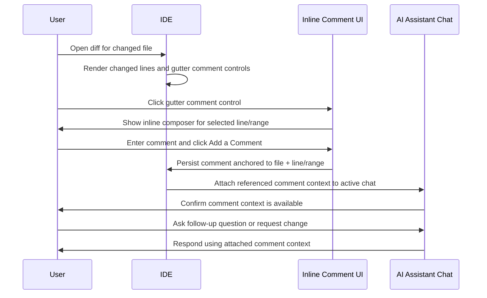

# PRD Flow: File and Diff Comments as AI Chat Context

Source video: `Screen Recording 2026-06-18 at 18.05.44.mov`

This document captures the product flow observed in the prototype video. It is intended as a structured PRD input for agents implementing or reviewing the feature.

---

## 1. Context

The prototype shows an IDE code review workflow where a user reviews agent-generated code changes, leaves contextual comments directly on editor or diff lines, and attaches those comments to the active AI chat. The comments become structured context for the assistant, allowing the user to ask follow-up questions or request changes without manually describing the exact file, diff hunk, or line.

The experience lives inside a JetBrains-style IDE shell with:

- A left Commit tool window showing changed files.
- A central editor/diff area.
- A right AI Assistant chat panel.
- Inline gutter comment controls in editor files and diff views.
- Settings controls for enabling/disabling file and diff comments.

## 2. Actors

| Actor | Description |
|---|---|
| User | Developer reviewing local or agent-generated changes before commit. |
| AI Assistant | Chat agent that can receive selected code comments as contextual attachments. |
| IDE | Hosts editor, diff viewer, commit tool window, settings, and comment UI. |

## 3. User Goal

The user wants to point the AI Assistant at specific code review comments, file lines, or diff hunks and ask for follow-up help with minimal manual context copying.

## 4. Entry Points

| Entry point | Observed behavior |
|---|---|
| Diff gutter comment control | User opens a comment composer on changed lines in `Diff VisitController.java`. |
| Editor gutter comment control | User opens a comment composer on a normal editor file such as `VisitController.java`. |
| AI Assistant chat attachment | Added comments appear as attachments in the active chat input or message context. |
| Settings dialog | User can enable or disable comment controls under `Tools > AI Assistant > Comments`. |
| Gutter context menu | User can toggle comments directly from the editor/diff gutter context menu. |

## 5. Observed Prototype Flow

### Starting State

- Project is open in a JetBrains-like IDE.
- Commit tool window lists `4 modified` files and `1 added` file.
- Files include `VisitController.java`, `Visit.java`, `AdapterScript.java`, and `FunctionUtils.java`.
- AI Assistant panel shows a completed task: refactoring `VisitController.java` so available visit time slots are initialized once and exposed through `@ModelAttribute("timeSlots")`.
- The assistant result includes a code preview card for `VisitController.java`, edited line counts, and a completed test run.

### Diff Comment Flow

1. User opens `Diff VisitController.java`.
2. Diff viewer displays `Unified viewer`, with changed lines highlighted in green.
3. User clicks the gutter comment control near the changed hunk.
4. Inline comment composer appears over the diff hunk.
5. Composer includes:
   - Chat target title, for example `Refactor VisitController time slots`.
   - `Active Chat` selector.
   - Text input placeholder `Write a comment`.
   - `Cancel` action.
   - `Add a Comment` primary action.
   - Line range summary, for example `Comments on lines 1 to 7`.
6. User enters comment text and clicks `Add a Comment`.
7. Comment card remains anchored to the diff hunk.
8. Gutter shows a comment indicator/count.
9. Active chat receives or updates an attachment for the diff, for example `Diff VisitController.java` with comment count.
10. AI Assistant acknowledges: `I reviewed the attached comment and will use it as context for this response.`

### Multiple Comments on Same Diff

1. User adds another comment on a nearby line or hunk.
2. Inline card shows multiple comments:
   - First comment on lines `1 to 7`.
   - Second comment on line `7`.
3. Diff gutter count updates.
4. Chat attachment updates from one comment to multiple comments.
5. Comment card exposes an overflow menu for each comment.

### Editor File Comment Flow

1. User switches from diff tab to `VisitController.java`.
2. User clicks gutter comment control on a specific editor line, for example line `12`.
3. Inline composer appears inside the editor.
4. User submits `comment 1`.
5. A comment card remains anchored to line `12`.
6. Chat input receives an attachment for `VisitController.java` with a comment count.
7. User adds another comment on another line, for example near `@ModelAttribute("vets")`.
8. The second card appears under a different chat/task label, for example `Review Visit model fields`.
9. Editor gutter shows per-line comment indicators and aggregate comment counts in the editor header.

### Settings and Discoverability

1. A blue informational toast appears in the AI panel:
   - `You can now leave comments directly on editor files.`
   - Action: `Enable File Comments`.
2. User opens Settings.
3. Settings path is `Tools > AI Assistant > Comments`.
4. Settings page has two toggles:
   - `Enable Comments in Files`
   - `Enable Comments in Diffs`
5. Both toggles are checked in the observed state.
6. User also opens a gutter context menu with:
   - Bookmark actions.
   - Soft-wrap actions.
   - Appearance actions.
   - `Configure Gutter Icons...`
   - `Enable Diff Comments` or `Enable File Comments`.

## 6. Happy Path

## 7. Use Cases

### UC-01: Add a diff comment to the active AI chat

**Preconditions**

- A file diff is open.
- Diff comments are enabled.
- An AI chat is active.

**Trigger**

- User clicks a gutter comment control in a diff hunk.

**Main flow**

1. IDE opens an inline composer anchored to the selected changed line or line range.
2. User writes a comment.
3. User clicks `Add a Comment`.
4. IDE saves the comment.
5. IDE attaches the diff comment to the active chat.
6. AI Assistant acknowledges that attached comment context is available.

**Expected result**

- Comment is visible in the diff.
- Gutter count reflects the comment.
- Chat attachment references the diff and comment count.

### UC-02: Add multiple comments to the same diff

**Preconditions**

- A diff already has at least one comment.

**Trigger**

- User adds another comment on the same hunk or another line in the diff.

**Main flow**

1. IDE opens a new composer for the selected line/range.
2. User submits a comment.
3. IDE groups comments by relevant line/range.
4. Chat attachment count updates.

**Expected result**

- Multiple comments remain readable from the inline card.
- Each comment can expose its own overflow menu.
- Attachment count is correct.

### UC-03: Add a file comment from the normal editor

**Preconditions**

- A source file is open in the editor.
- File comments are enabled.
- An AI chat is active.

**Trigger**

- User clicks a gutter comment control in the editor.

**Main flow**

1. Inline composer appears next to the selected line.
2. User submits a comment.
3. Comment card is anchored to the editor line.
4. Chat attachment references the file and comment count.

**Expected result**

- Comment appears in the editor, not only in the diff.
- Attachment is tied to the source file, line, and active chat.

### UC-04: Configure comments availability

**Preconditions**

- User has access to IDE Settings.

**Trigger**

- User opens `Tools > AI Assistant > Comments` or uses the gutter context menu.

**Main flow**

1. User toggles file comments and/or diff comments.
2. IDE updates gutter comment controls accordingly.
3. User confirms settings.

**Expected result**

- Disabled surfaces hide or disable comment controls.
- Enabled surfaces show gutter comment controls where applicable.

## 8. Alternative Flows

| Flow | Expected behavior |
|---|---|
| User cancels composer | Composer closes, no comment is added, chat attachment remains unchanged. |
| User changes active chat before submitting | Composer should clearly show the target chat; submitted comment attaches to the selected chat. |
| User adds a comment without typing text | `Add a Comment` should remain disabled or validation should prevent empty comments. |
| User edits an existing comment | Comment content updates and attached chat context refreshes or marks itself stale. |
| User deletes a comment | Gutter count and chat attachment count decrease; attachment is removed if no comments remain. |
| User disables file comments from toast/settings | Editor gutter file comment controls disappear; existing comments should remain accessible through a stable fallback. |
| User disables diff comments from context menu/settings | Diff gutter comment controls disappear; existing diff comments should not be silently deleted. |

## 9. Edge Cases

- Comment is attached to a line that later changes because the user edits the file.
- Comment is attached to a diff hunk that disappears after rebase, revert, or applying agent edits.
- Multiple chats are open and the user selects the wrong active chat.
- User adds comments before the AI Assistant panel is open.
- AI Assistant is offline, not authenticated, or model selection is invalid.
- The file is unversioned and has no diff base.
- The same file is open in both editor and diff tabs.
- Comment range spans deleted and added lines.
- The user collapses the changed file group in the Commit panel after adding comments.
- The user commits or pushes while comments are still attached to chat context.
- Toast overlaps the chat input or blocks comment attachment controls.
- Settings toggle is changed while a comment composer is open.
- Long comments overflow the inline card.
- Multiple comments on adjacent lines make the editor difficult to scan.

## 10. Functional Requirements

### Comment Creation

- The system shall show gutter comment controls in editor files when file comments are enabled.
- The system shall show gutter comment controls in diff views when diff comments are enabled.
- The system shall open an inline composer anchored to the selected file line, diff line, or diff range.
- The composer shall display the target chat and allow the user to change it when multiple chats are available.
- The composer shall support canceling without side effects.
- The composer shall prevent empty comment submission.
- The system shall persist comments with file identity, line/range, surface type, and target chat.

### Chat Context Attachment

- The system shall attach submitted comments to the selected AI chat.
- The chat input or message context shall show the attachment source, such as `VisitController.java` or `Diff VisitController.java`.
- Attachment labels shall show comment count when more than one comment is attached.
- The AI Assistant shall be able to use attached comments as context in its next response.
- The UI shall make it clear when comments are attached to the active chat.

### Comment Display

- The system shall render submitted comments inline near the relevant editor or diff location.
- The gutter shall show per-line or per-range comment indicators.
- Multiple comments on the same or nearby range shall be grouped without hiding individual comment text.
- Each comment shall expose an overflow menu for management actions.

### Settings

- The system shall provide `Enable Comments in Files` under AI Assistant comment settings.
- The system shall provide `Enable Comments in Diffs` under AI Assistant comment settings.
- The system shall provide gutter context-menu toggles for comment availability.
- The system shall show an informational toast when file comments become available or need enabling.

## 11. Non-Functional Requirements

- Inline comment UI must not obscure the selected code more than necessary.
- Comment cards must preserve code readability and editor scrolling performance.
- Comment state must remain stable across tab switches between file and diff views.
- The experience must match IDE density, dark theme surfaces, gutter rhythm, and AI Assistant panel styling.
- Keyboard focus must move predictably between editor, composer input, and chat input.
- Comment controls must be discoverable but not visually noisy in the gutter.

## 12. UI States

| State | Description |
|---|---|
| Comment control idle | Gutter icon visible for eligible line/range. |
| Composer open | Inline card with chat target, input, cancel, and add action. |
| Empty composer | Submit action disabled or validation shown. |
| Comment saved | Inline comment card anchored to line/range. |
| Multiple comments | Inline card lists comments and line summaries. |
| Attached to chat | Chat input shows file/diff attachment with count. |
| Assistant acknowledged | Assistant message says attached comment will be used as context. |
| Settings enabled | File/diff comment toggles checked. |
| Settings disabled | Gutter controls hidden or disabled for that surface. |
| Informational toast | User is told file comments can be enabled directly. |

## 13. Analytics Events

| Event | Properties |
|---|---|
| `ai_comment_composer_opened` | `surface`, `file`, `line`, `range`, `chat_id` |
| `ai_comment_added` | `surface`, `file`, `line`, `range`, `comment_length`, `chat_id` |
| `ai_comment_cancelled` | `surface`, `file`, `line`, `range` |
| `ai_comment_attached_to_chat` | `surface`, `file`, `comment_count`, `chat_id` |
| `ai_comment_context_used` | `chat_id`, `comment_count`, `model` |
| `ai_comments_setting_toggled` | `setting`, `enabled`, `entry_point` |
| `ai_comment_toast_action_clicked` | `action` |

## 14. Acceptance Criteria

- User can add a comment from a diff hunk and see it attached to the active AI chat.
- User can add more than one comment to the same diff and see the attachment count update.
- User can add a comment from a normal editor file and see it attached to the active AI chat.
- Comments remain visually anchored to the correct file line or diff range after switching tabs.
- Chat attachments distinguish editor file comments from diff comments.
- AI Assistant acknowledges available attached comment context.
- Settings include separate toggles for file comments and diff comments.
- Gutter context menu exposes a relevant enable/disable comment action.
- Empty comments cannot be submitted.
- Canceling a composer does not create a comment or mutate chat attachments.

## 15. Open Questions

- Are comments stored only locally, or do they become part of code review/commit metadata?
- Should comments survive commit, branch switch, file rename, or rebase?
- Can a single comment be attached to multiple chats?
- Should comments attach immediately on save, or only when the user explicitly adds them to chat?
- Should the AI Assistant automatically respond after a comment is attached, or only after the user sends a prompt?
- What management actions belong in the comment overflow menu: edit, delete, resolve, copy link, detach from chat?
- How should comments behave on deleted lines in unified diff views?
- Should enabling/disabling comments be project-specific, IDE-wide, or chat-specific?
- Should the blue toast appear once, per project, or whenever comments are disabled?
- How should comment context be represented in prompts sent to the model?

