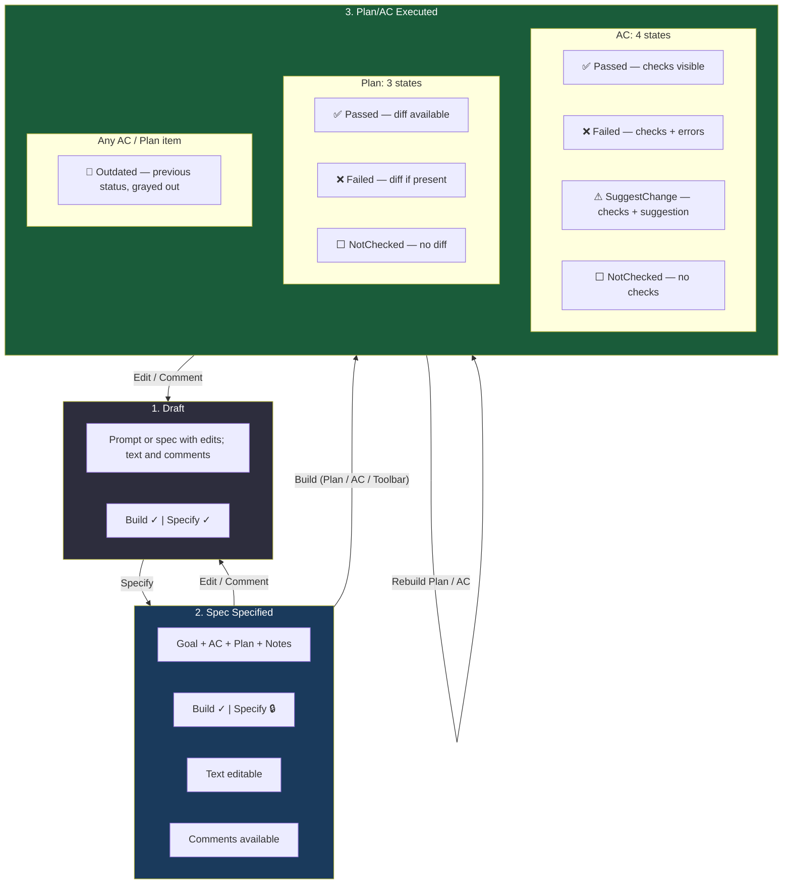
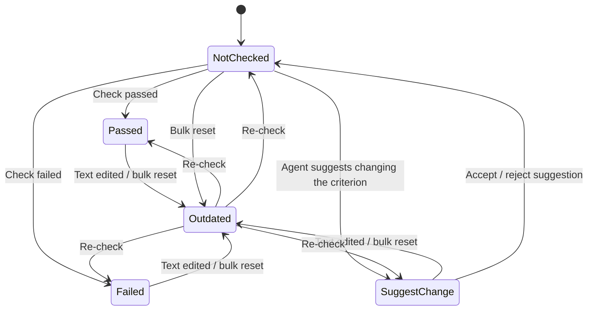
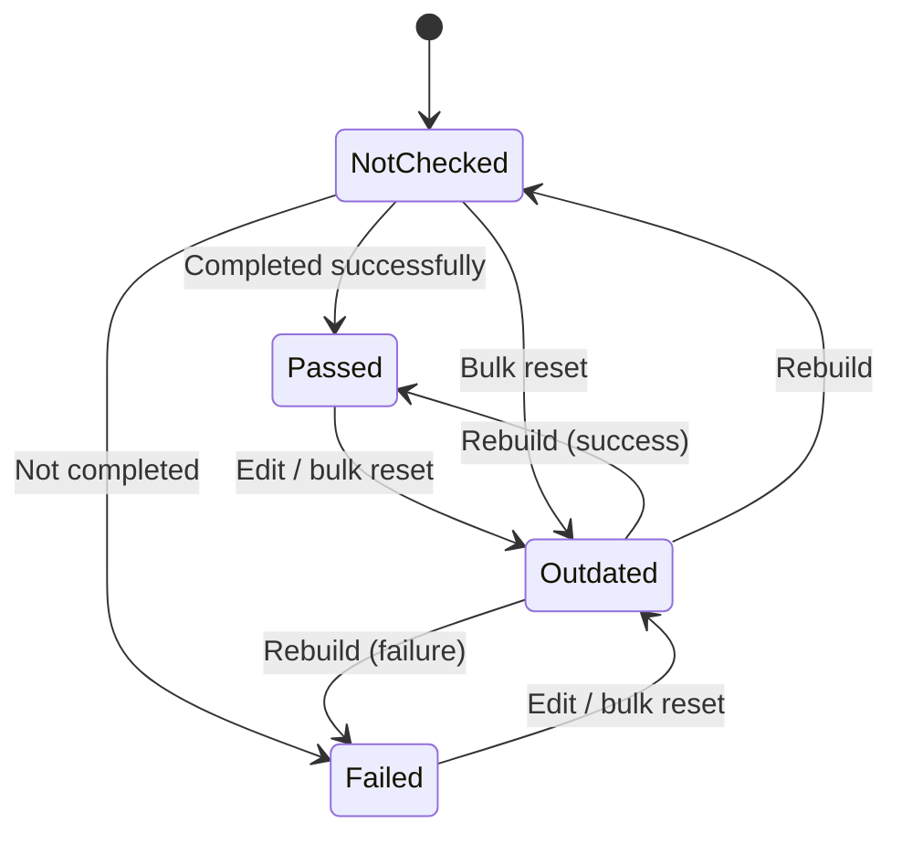
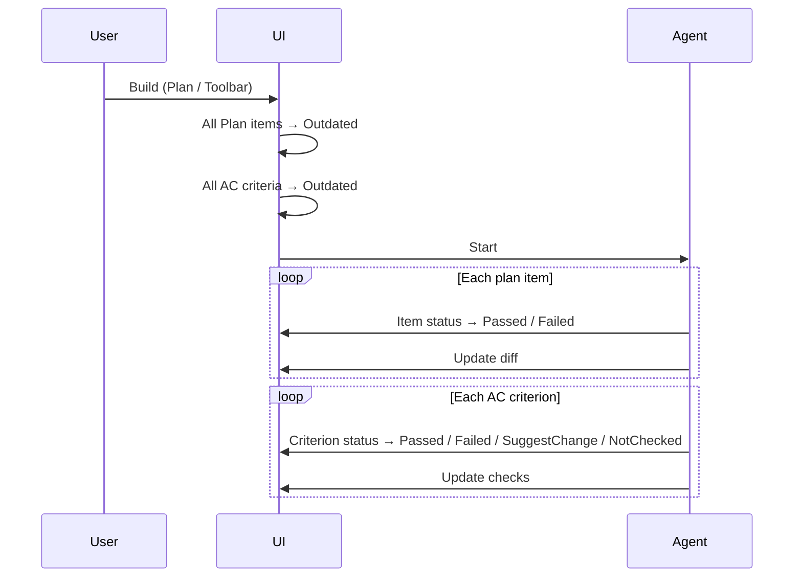
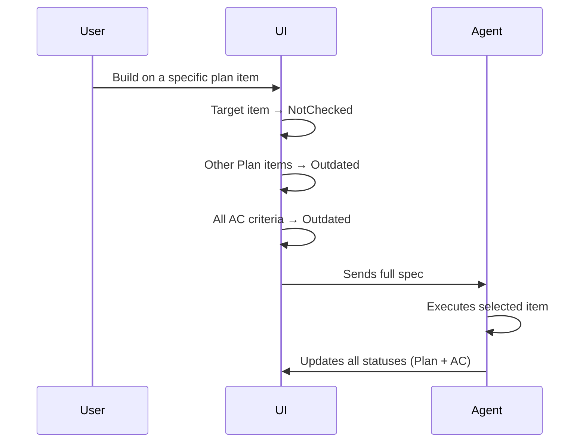
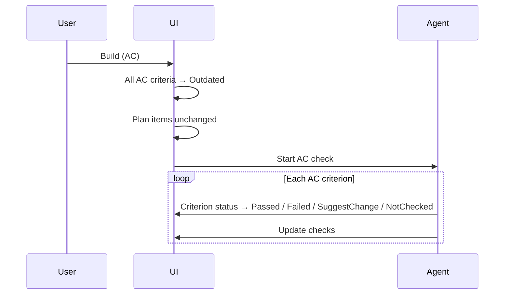

# Spec Flow: Agent Task Specification Lifecycle

This document describes the full lifecycle of an agent task specification: from a prompt in a file through plan execution and Acceptance Criteria verification.

---

## Full state map

---

## Outdated status

A shared status for AC and Plan items. It is **not** a separate state — it is a **display modifier**: the item keeps its previous status (Passed, Failed, SuggestChange, NotChecked) but is rendered in a **muted, grayed-out** color.

An item stops being Outdated when:
- It is re-checked or re-executed — the status updates to the current value

---

## 1. Draft

A single draft state: you can **edit text** and **leave comments**. **Build** and **Specify** are both enabled. `Specify` creates the first structured spec or updates an existing one, depending on the current document.

### Content

- An `.md` file is open: either a plain-text prompt only, or a structured spec (Goal, AC, Plan, Notes) — including user edits and comments
- **Text** is **editable**; **comments** are available

### Button state

| Button | State | Condition |
|--------|-------|-----------|
| **Build** (toolbar) | ✓ Enabled | Specification is valid (format heuristic) |
| **Build** (AC) | ✓ Enabled | Acceptance Criteria section exists |
| **Build** (Plan) | ✓ Enabled | Plan section exists |
| **Specify** | ✓ Enabled | Creates the first structured spec or updates an existing spec when there are edits or comments |

### Transitions

| Transition | Action | What happens |
|------------|--------|--------------|
| **→ 2. Spec Specified** | **Specify** is clicked on a prompt-only draft | The agent turns the prompt into a structured specification. Sections appear: Goal, Acceptance Criteria, Plan, Notes. |
| **→ 2. Spec Specified** | **Specify** is clicked on an edited spec | The agent updates the spec with edits and comments applied. After a successful Specify, the button behaves like **2. Spec Specified** again (🔒 until the next edits). |

---

## 2. Spec Specified

### Content

The specification is shown in structured form:

| Section | Description |
|---------|-------------|
| **Goal** | Short description of the task goal |
| **Acceptance Criteria** | List of acceptance criteria (checkboxes) |
| **Plan** | List of implementation steps |
| **Notes** | Additional notes |

- The toolbar shows a **summary** of the specification
- **Text** in all sections is **editable**
- **Comments** can be left in all sections

### Button state

| Button | State | Condition |
|--------|-------|-----------|
| **Build** (toolbar) | ✓ Enabled | Specification is valid |
| **Build** (AC) | ✓ Enabled | Runs AC checks only |
| **Build** (Plan) | ✓ Enabled | Executes the plan, then checks AC |
| **Specify** | 🔒 Disabled | No edits or comments |

### Transitions

| Transition | Action | What happens |
|------------|--------|--------------|
| **→ 1. Draft** | User **edits text** or **adds a comment** | Content changed but the spec has not been updated by Specify yet; **Build** and **Specify** are available in Draft. |
| **→ 3. Executed** | **Build** (Toolbar or Plan) is clicked | All plan items run in sequence, then all AC are checked. Each item gets a status. |
| **→ 3. Executed** | **Build** (AC) is clicked | Only Acceptance Criteria are checked; the plan is not executed. Each criterion gets a status. |

---

## 3. Plan/AC Executed

### Content — Acceptance Criteria

Each AC criterion is in one of 4 states (+ Outdated modifier):

| State | Icon | Checks | Description |
|-------|------|--------|-------------|
| **Passed** | ✅ | Shown (green) | Criterion passed |
| **Failed** | ❌ | Shown, failed highlights | Criterion not passed |
| **SuggestChange** | ⚠ | Shown + suggestion to change the criterion | Agent thinks the criterion should be adjusted |
| **NotChecked** | ⬜ | None | Criterion not checked; unchecked |
| **Outdated** | 🔘 | Grayed out | Previous status kept, shown muted |

### Content — Plan

Each plan item is in one of 3 states (+ Outdated modifier):

| State | Icon | Diff | Description |
|-------|------|------|-------------|
| **Passed** | ✅ | Available (Show diff) | Item completed successfully |
| **Failed** | ❌ | Available if there are changes | Item not completed |
| **NotChecked** | ⬜ | None | Item not checked |
| **Outdated** | 🔘 | — | Previous status kept, shown muted |

### Button state

| Button | State | Condition |
|--------|-------|-----------|
| **Build** (toolbar) | ✓ Enabled | Rebuilds full plan + AC |
| **Build** (AC) | ✓ Enabled | Re-checks all AC |
| **Build** (Plan) | ✓ Enabled | Rebuilds full plan + AC |
| **Specify** | 🔒 Disabled | No edits (Enabled if there are edits/comments) |
| **Build** (per AC item) | ✓ Enabled | Re-checks that criterion |

### Transitions

#### Rebuild full plan

| Transition | Action | What happens |
|------------|--------|--------------|
| **→ 3. Executed** (self) | **Build** (Toolbar / Plan) is clicked | 1. All Plan items → Outdated. 2. All AC criteria → Outdated. 3. Agent runs each plan item in order, updating statuses and diffs. 4. Agent checks each AC criterion, updating statuses and checks. |

#### Rebuild a single plan item

| Transition | Action | What happens |
|------------|--------|--------------|
| **→ 3. Executed** (self) | **Build** on a specific plan item is clicked | 1. Target item → NotChecked. 2. Other Plan items → Outdated. 3. All AC criteria → Outdated. 4. Agent receives the full spec, runs the item, and refreshes all Plan + AC states. |

#### Re-check all AC

| Transition | Action | What happens |
|------------|--------|--------------|
| **→ 3. Executed** (self) | **Build** (AC) is clicked | 1. All AC criteria → Outdated. 2. Plan items unchanged. 3. Agent checks each criterion, updating statuses and checks. |

#### Re-check a single AC criterion

| Transition | Action | What happens |
|------------|--------|--------------|
| **→ 3. Executed** (self) | **Build** on a specific criterion is clicked | 1. Target criterion → Outdated. 2. Other AC criteria and Plan items unchanged. 3. Agent checks the criterion, updating its status and checks. |

#### Editing

| Transition | Action | What happens |
|------------|--------|--------------|
| **→ 1. Draft** | User **edits** AC **text** | Edited criterion → Outdated. Others unchanged. |
| **→ 1. Draft** | User **edits** Plan **text** | Edited item → Outdated. Others unchanged. |
| **→ 1. Draft** | User **adds a comment** | Statuses unchanged. |

---

## Transition matrix: action → what changes

| Aspect | Build (Toolbar) | Specify | AC Build | AC Item Build | Plan Item Build | Edit AC | Edit Plan | Comment |
|--------|---------------|---------|--------|-------------|---------------|---------|-----------|---------|
| **Plan statuses** | All → Outdated → Re-exec | — | Unchanged | Unchanged | Target → NotChecked, rest → Outdated → Re-exec | Unchanged | Item → Outdated | Unchanged |
| **AC statuses** | All → Outdated → Re-check | — | All → Outdated → Re-check | Target → Outdated → Re-check, rest unchanged | All → Outdated → Re-check | Item → Outdated | Unchanged | Unchanged |
| **Diffs** | Updated | — | Unchanged | Unchanged | Updated | Unchanged | Unchanged | Unchanged |
| **Specify** | Unchanged | 🔒 after use | Unchanged | Unchanged | Unchanged | ✓ Enabled | ✓ Enabled | ✓ Enabled |

---

## Open questions

- [ ] **How are diffs updated?** When a plan item is rebuilt — is the diff recomputed relative to what? Relative to state before the first build? Relative to the previous build? Do diffs accumulate across builds?
